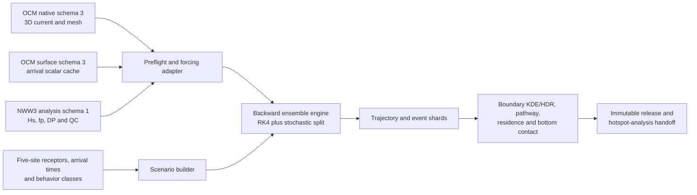

# Lagrangian Ensemble Backtracking

本專案實作「三、Lagrangian 系集逆向溯源」：針對完全沉沒於三維水體中的沉降與近底海洋廢棄物，以 CWA-OCM 三維海流、CWA-NWW3 波浪衍生的 Stokes drift、向下沉降速度及次網格擴散，從受體位置與到達時間向過去建立條件式來源足跡。

目前狀態為 `reference_core_implemented_formal_runtime_cli_connected_report_trajectory_stream_report_statistics_facade_report_release_io_report_validation_evidence_schema_io_implemented_release_gated`。設定/preflight、native forcing adapters、
signed-time RK4、Stokes、擴散、巢狀邊界、scenario×member 分片、不可變 shard/checkpoint 與
核心聚合均已有可執行實作及測試；報告純統計層亦已具備停止結果與方向性跨站來源矩陣、
來源段—受體條件式比例／事件占比／旅行年齡，以及統一的 renderer-facing typed facade。
這些產品保留 raw numerator／denominator、低樣本或零分母等不可用狀態，並維持公尺格網
``(y, x[, age])`` 與 source→target site axis；`report_trajectory_stream.py` 已可對完整
trajectory iterator 一次串流，依有效 member 政策同步建立 pathway、環境完整性、材質與
代表軌跡 products；`report_release.py` 已提供 report-v1 的 source binding、fixed topology、
atomic writer／reader／validator。這些都是可重現的工程資料契約，不能把 typed facade 或
synthetic release 通過測試解讀為正式科學成果。共同 staging/格式/校驗基礎已完成：
`report_render.py` 可接受 caller 已驗證的 typed products／圖面 callback，在明示空白 staging
root 產生固定格式、canonical sidecar、實際 bytes size／SHA-256 與 immutable staging view；
`report_validation_evidence.py` 的 F12/T06 定量 evidence schema/I/O 已完成：schema `1.0.0`、
immutable `ValidationMetric`／`ValidationEvidence`、canonical source binding，以及 strict
load／validate／atomic write 都已接入公開 API。這只完成 evidence 的工程契約；解析解（`analytic_solution`）、
dt/M 收斂（`timestep_convergence`／`member_convergence`）、
known-source（`known_source_synthetic`）、restart（`checkpoint_restart`）、NumPy/Numba
（`numpy_numba_consistency`）與 forward-validation（`forward_validation`）的正式 evidence
尚未產生，因此 F12/T06 科學成果仍未完成。`report_pipeline.py` 的建置前唯讀 gate 已完成（complete run、
aggregate/spec binding、formal trajectory v2、MPLCONFIGDIR、output/evidence policy）；但
`build_report_release`、F01–F12/T01–T06 專屬 artifact adapters、CLI `report-build` 與正式 SERVER 科學發布
仍未完成，不能把 preflight 稱為完整 pipeline。`report_comparison_statistics.py`
F11/T05 的 exact compatibility 與核心差值純計算已完成：它只接受兩份相同研究設計的
`ReportStatistics` 與 caller 明示的單一物理參數差異，保留 comparison 減 baseline 的
outcome、connectivity、source-receptor、pathway、HDR 差值；材質來源核對尚未完成，目前不提供材質差值。
不可用狀態或零分母不補成零。comparison release I/O、artifact adapter、pipeline/render 整合與真實 sensitivity cases 尚未完成，
不能稱 F11/T05 科學成果完成。SERVER synthetic shard
驗證成功。研究
團隊已將現存
OCM/NWW 凍結為正式的「2024–2025 全部可得資料」母體，`trial_ready`、partial month 與
供應者 metadata 不再是等待外部補件的阻擋。正式模擬尚未宣稱完成，是因 OCM 缺時重建
交叉驗證（或 gap-safe arrival/horizon manifest）、NWW 完整逐時 analysis、expanded A 與
數值／幾何衍生 gate 尚須由正式 release config、SERVER preflight inventory 與核准 manifests
提供；example config 仍刻意 blocked。修正後的
證據與方法見[全部可得資料、時間重建與 A 區擴張決策](docs/10_available_data_time_reconstruction_and_a_expansion.md)。

目前已完成 Phase 1 CPU 批次資料／幾何基礎元件，以及 Phase 2 可重啟 CPU 批次核心：
`ParticleBatch` 以結構分離陣列保存粒子狀態，`ParticleExecutionState` 保存單粒子可暫停
執行游標，`ProductionBatch` 依固定 source order 做 active compaction、分塊單步與 scatter；
schema 2 checkpoint 另保存完整觀測、事件、triangle hint 與每粒子 PCG64DXSM RNG state。
這是共用 reference engine 的 CPU/NumPy orchestration，尚不是完整 Numba physics kernel。
目前 formal/pilot runtime 都已接上實際 pair initial condition、forcing window 與 run controller，
並提供 `lbt run-create`、`lbt run-shard`、`lbt run-reconcile`；formal 會套用正式 forcing、
inventory、gap-safe/full-product 與 release gate，任何 gate 失敗都 fail-closed 且不降級成 pilot。
example config 因仍缺正式 SERVER manifests 而刻意被 gate 阻擋。Phase 3A 已補上嚴格的
material/receptor/arrival-time/geometry manifest loader，以及以 UTC 月份為邊界的
`ForcingWindowManager`；這些元件只完成輸入契約與 lazy cache，尚不代表正式 2024–2025
批次已啟動。Phase 3B1 另已完成不含絕對專案路徑的 code provenance、immutable run plan、
atomic progress/checkpoint controller、run validator 與工程 benchmark report；這些契約已由
pilot runtime 使用，並可用 synthetic/pilot fixture 驗證，但不會假裝已完成 formal forcing。

Phase 3B2a/3B2b 已將 run plan 升為 schema `2.1.0`：情境依
`analysis_region_arrival_utc_site_material_receptor_scenario_v1` 固定排序，且只在同一
`analysis_region_id`／到達 UTC 奈秒 execution group 內切 shard；這只改善 I/O locality，
不改科學樣本、`scenario_id`、particle ID 或 seed。2.0.0 workspace 仍可唯讀解讀為 full
selection，但新 writer 一律寫入 `scenario_selection`。每個 workspace 另有固定的
`locks/run_gate.lock`、`locks/progress.lock` 與每 shard lock，Unix `fcntl.flock` 依
run gate → shard → progress 順序保護跨程序 progress/reconcile；one-process-per-shard
已由 `lbt run-shard` 提供 pilot/formal 執行入口；`lbt run-reconcile` 不載入 config/forcing、不建立物理 request；在 run gate 與 validator 通過後可原子更新 progress，採認合法 output/checkpoint 現場狀態；`validate-run` 才是唯讀驗證。
schema 1 的舊 synthetic/pilot workspace 沒有相容 resume 路徑，必須重建，不能猜測舊排序。

Slice 3B2b 的 `pilot_selection.py` 只對完整且已驗證的 scenario/receptor manifests 做
工程 pilot 抽樣。`--pilot-scenarios-per-stratum 1` 會依每個
`(study_site_id, receptor.vertical_id)` strata 選一筆；目前五站、四個垂向層位的完整
資料因此得到 `5×4=20` 筆，這只是 sanity／benchmark 子集，不是正式結果，也不改變正式
`50,000` 個基礎情境設計。selection binding 以版本化 SHA-256 ranking policy、source/
selected count/hash 與 strata 綁定 immutable plan；`run-shard`／static loader 會由目前完整
manifest 重算後再比對 scenario table。formal run 禁止 selector，仍必須執行完整 `50,000`。

單站沉降先導另可在 `run-create --run-kind pilot` 同時指定 `--pilot-study-site-id`、
`--pilot-arrival-id`、`--pilot-material-id`，從完整五萬來源選取該組合的全部受體；不得與
分層 N 混用、缺項或重複指定。現行單站為 5 水平×4 垂向，共 20 個基礎情境，粒子數為
`20×M`，M 是每情境隨機成員數，不是情境數。獨立 `pilot_exact` 繫結版本 `2.0.0`
保存三 ID、完整來源記錄與來源／選中 ID 雜湊、數量及完整受體集合證據；根 run-plan
仍為 `2.1.0`，舊 full／stratified 繫結維持 `1.0.0`。來源先通過既有靜態檢查及
五萬覆蓋驗證，建立／重開／續跑均重算，不能先裁剪來源再宣稱完整。情境 ID、負沉降
速度、原始 seed 推導與校準設定不變；此小樣本未經 M／dt 收斂或觀測驗證，不是正式科學
結論或絕對來源機率。精確參數與重建步驟見 [單站先導執行計畫](docs/pilot_run_plan.md)。

runtime 的回溯天數轉換由 formal gap-safe 與 request factory 共用：舊十進位規則已能
精確表示的整數奈秒保持不變；其餘先按 builder 的 `days×86400` 轉秒，僅接受誤差
嚴格小於 0.5 ns、至多兩個秒數浮點間距且能往返重建原始天數的整數奈秒候選。
因此 `1/24` 天還原為 3600 秒／3,600,000,000,000 ns，半小時與可還原的 10 ns 亦可用；
`1e-12` 天＝86.4 ns 仍在建立 forcing manager 前拒絕。非有限值、奈秒長度或最早 UTC
超出有號 64 位範圍同樣拒絕。這是表示精度契約，不是任意捨入或宣稱次奈秒準確度；
設定檔、到達 UTC、ID、seed、物理步長及驅動資料皆不改動。

完整 `pilot_exact` 可用獨立 `uv run python scripts/build_pilot_preview.py --run "$PILOT_RUN" \
--config "$PILOT_CONFIG" --output "$PILOT_PREVIEW"` 建立新的 `pilot-preview-v1` 目錄；
不是正式 `report-build` 或 `report-v1`。先只讀小型計畫／分片清單拒絕超量輸入，再完成
靜態來源綁定與全部完成驗證，僅讀 schema 2 已記錄軌跡，不讀 forcing 或重算路徑。
輸出水平總覽＋各水平受體局部放大圖、四垂向實值 z／eta／bed—回溯秒數圖、全成員
停止原因圖（3 PNG），以及全量粒子／觀測 CSV、summary JSON、繁中說明與 SHA-256 清單。
失敗與零位移成員不刪除；畫線依固定成員順序限量且揭露 n/N，局部圖維持真實公尺刻度。
`MPLCONFIGDIR` 必須預先設定為專用普通目錄；可明示 `--font-path`，無合格中文字型時
圖用英文、說明仍用繁中，不下載字型或地圖。輸出不得原地重建、覆寫或經符號連結，
沿用已驗收的原子拒覆寫改名；不支援的平台停止發布。合成測試圖不是 PI 真資料成果。

失敗終止事件現保存 `diagnostic_version=1`：白名單原因／階段
`failure_reason`／`failure_stage`、品質位元 `qc_flags`、有方向的嘗試 dt、步數／下限
累計與上限、失敗查詢 XYZ 公尺／UTC 奈秒及可得海面／海床。未知或非有限數值在來源
事件中省略，對應 availability 為 false，不補 0 或 null；preview 表格才將缺欄明示為
空欄／JSON null，缺文字為 unknown。未改輸出格式、取樣、RNG 或重試政策；診斷提升
可追查性，不表示數值失敗已修復。

本次 Slice 3B2a-A 已補強並接通上述契約：geometry loader 在 formal 模式依
`resolve_flow_domain_id` 綁定 A 區 expanded ID，provenance 固定 Git／declared deployment
來源與 dirty 語意，設定欄位改用 `checkpoint_interval_sweeps`、`active_chunk_size` 與
`max_resident_forcing_months`，並把 formal initializer、inventory semantic gate、generic
controller 與 CLI 接上。程式已具備正式執行入口，但本 slice 未登入、SERVER 或正式研究 run，
不能宣稱已完成實值 SERVER 科學批次或正式成果。

Slice 1 的 SERVER v3 輸入衍生與 release orchestration 也已接通：`input_derivation.py`
只讀取已驗收的 OCM schema 3 `ocm_native`、OCM schema 3 `ocm_surface` 與 NWW3 schema 1
`nww3_analysis`，可重建 forcing inventory、OCM gap-safe arrival/horizon、NWW 17,544
小時證據、四域／五站幾何、100 receptors、250 arrivals、5,000 receptor×arrival dynamic
initial conditions，以及 exact hash-bound release config。輸出採 canonical JSON、sidecar
SHA-256、artifact index、目錄 closure 與 atomic immutable publish；大型 required NPY 以
size／NPY header structural fingerprint 綁定，metadata 與 UTC time axis 保留實際內容 hash，
避免正式建置逐 byte 掃描 TB payload。A 區公開標籤固定為「A 區分析域」，但 provenance
仍以同一個明示註冊的 base／expanded bbox 綁定實際 flow-domain ID、schema 與 source
fingerprint，不把 v4 ID 與 v3 bbox 混用。操作契約見[Slice 1 輸入衍生與
release contract](docs/14_input_derivation_and_release_contract.md)。

受體垂向模板與每一個 dynamic pair 現在共用三節點／四節點 face 的垂向支撐 gate：
代表性水柱先排除 `bed <= zcor <= eta` 之外的 layer，再沿用 10%、40%、70% 與 near-bed
類別；每個 node 都必須對每個所需 target 提供有限的上下雙側 `zcor`。陡峭海床造成的
淺節點缺 below 或深節點缺 above 時，候選 face 會進 deterministic blacklist，並以原本
的 persistent-wet／geometry／maximin 規則重選；不使用最近 layer、單側外插、重正規化或
零值補缺。dynamic pair 若與 receptor gate 不一致則 fail closed。immutable artifact
在原子發布前還會以當次 config、formal flag 與三個顯式 accepted roots 執行既有
`validate_input_derivatives`；cross-reference 失敗會清除 hidden partial，不留下 final
目錄。這些限制與純 fixture 測試見[Slice 1 輸入衍生契約](docs/14_input_derivation_and_release_contract.md)。

每個 arrival 與水平 receptor 候選的 NWW gate 現在都與 runtime 的
`NWWAnalysisMonth.sample` 對齊：NWW 必須是有限、嚴格遞增的一維 lon／lat 規則格網，
座標在域內，四角 static mask 與該 exact-hour 的 `valid_mask_wave` 全部有效，且四角
Hs、peak frequency、原始波向有限；Hs／fp 使用同一組雙線性權重，波向以 sin/cos
合成並要求向量非退化、Hs≥0、fp>0。任一水平 face 的 50 個 arrival 只要有一個不支援，
就進本站 deterministic blacklist 並重選；這個初始 gate 不宣稱粒子移動後整條回溯路徑
永遠不會遇到海岸、域外或 forcing QC 失敗，路徑仍由 runtime 每個 stage 的 QC 控制。

Arrival 的 NWW metric proxy 採版本化 `anchor_first_nearest_runtime_supported_nww_cell_center_v1`：
先試站點 anchor，只有完整 strict `48+2` selector 失敗時，才在 local polygon 內搜尋距離不超過
anchor 附近實際 NWW lon/lat 軸投影格網尺度兩倍的 bilinear cell center，並以公尺距離、`y0`、
`x0` 穩定排序。每筆 arrival 都保存位置種類、經緯度、距離、格網尺度、四角 cell index 與
policy ID；這個 proxy 僅供 arrival 分層／事件指標，不取代 receptor 實際位置或 runtime trajectory
sample。貢寮／龜山島 paired UTC 仍以貢寮選出的 UTC 為 reference，但 clone 前會用龜山島自己的
OCM／NWW／gap-safe 支援驗證並重寫物理 metadata；CLI `inputs-build` 維持 strict、fail-closed，
不啟用 synthetic fallback。

## BayTrace 可用部分整合界線

本專案只整合 BayTrace 可對應本地 CPU 執行的工程思路：CPU SoA／batch／chunk、每粒子可
重現亂數、SCHISM triangle hint、可暫停 engine，以及 schema 2 checkpoint/restart。未採用
GPU/CUDA、BayTrace raw `schout`／`bp` I/O、oil/weathering、droptime、共享記憶體
multiprocessing，也未放寬 backward round-trip 成功判定。`ptrack4a` 只保留為未來具備完整
相容 fixture 時的 golden reference；目前不把它當成正式驗證結果。

## 工項邊界

本專案負責：

- 讀取 SERVER 上已前處理完成的 2024-2025 OCM `ocm_native`／`ocm_surface` 與 NWW3 `nww3_analysis`。
- 沿用 A-D 四個 OCM/NWW forcing flow domains，對貢寮、龜山島、新竹、後灣與連江五個獨立研究站點，各建立 10 種全為負值的海廢材質／形狀沉降代理、20 個三維受體與 50 個到達時間的完整情境設計；全案共 100 個 receptors。
- `Receptor` manifest 的 100 筆是水平位置與 `vertical_id` 的模板，arrival-time manifest 共 250 筆；每個 receptor×arrival pair 另有一筆由到達時刻 OCM `eta`／`zcor`／`wetdry` 摘要而來的 dynamic initial-condition record，正式全案恰為 5,000 筆（每站 1,000 筆）。十種 material 共用同一筆 pair 初始條件，因此 scenario builder 仍只產生 50,000 個 `material×receptor×arrival` 情境，不重複展開 50,000 筆初始深度。
- 實作三維 OCM 速度內插、有限水深 bulk Stokes drift、向下沉降、水平與垂向擴散、逆時間積分及邊界事件。
- 產出軌跡、停止事件、邊界穿越、路徑密度、停留時間、底部接觸與 KDE/HDR 等可追溯產品。
- 以解析場、統計性質、正向-逆向合成案例、時步／系集／domain 敏感度與 checkpoint 重啟測試完成驗收。

本專案不負責：

- LBT runtime 不直接讀取原始 NetCDF／transfer archive；expanded A 與完整逐時 NWW analysis
  仍由相鄰前處理專案的正式入口產製，本專案負責版本、驗證與唯讀接線。
- 重做 `OCM-SVD-Analysis`，或實作 TRAP 分析。
- 對完全沉沒物體加入 windage；若未來擴充表面漂浮類別，必須另立方法版本。
- 在缺少先驗、觀測及調查努力量時，把條件式足跡宣稱為絕對來源機率、法律責任或因果歸因。
- 在缺少底床剪應力與再懸浮參數時，宣稱已完整模擬沉積-再懸浮動力。

## 上游資料

| 上游專案 | 正式輸入 | 本專案用途 |
|---|---|---|
| `OCM-Data-Preprocessing` | schema 3 `ocm_native/<flow_domain_id>/grid` 與 `months/YYYYMM` | 原生 SCHISM node/face/edge 拓撲、`hvel`、`vertical_velocity`、`zcor`、`elev`、`wetdry_elem`、`diffusivity`；geometry、receptor 與 dynamic pair 使用 |
| `OCM-Data-Preprocessing` | schema 3 `ocm_surface/<flow_domain_id>/grid` 與 `months/YYYYMM` | arrival selector 使用的規則格網 `u_surface_mps`、`v_surface_mps`、`surface_z`、`eta_m`、`valid_mask_surface`、`qc_flags`；不替代 native 三維 forcing |
| `NWW-Data-Preprocessing` | schema 1 `nww3_analysis/<flow_domain_id>/months/YYYYMM` | 由完整 17,544 小時 native 軸對位靜態 OCM 格網的 `significant_wave_height`、`peak_frequency`、`peak_direction_raw_deg`、遮罩與 QC |
| `OCM-SVD-Analysis` | 參考其全部可得資料 canonical time、固定 z 垂向內插與 run manifest | 不把既有 SVD 模態直接當粒子 forcing；LBT 的 EOF-state-space 重建另立版本與驗證 |

正式路徑一律由環境變數或設定注入，程式內不得硬編碼：

```text
OCM_NATIVE_ROOT=/data/OCM-Preprocessed-Data/preprocessed/ocm_native
OCM_SURFACE_ROOT=/data/OCM-Preprocessed-Data/preprocessed/ocm_surface
NWW_ANALYSIS_ROOT=/data/NWW-Preprocessed-Data/preprocessed/nww3_analysis
LBT_OUTPUT_ROOT=<具足夠容量且經 preflight 確認的本機或 SERVER 路徑>
```

以上路徑已由 2026-08-17 SERVER 唯讀 preflight 確認；正式 release 仍須逐次保存實際目錄、月份、metadata、input fingerprint、容量及權限結果，避免已更新的上游資料被未察覺地混入續跑。

## 四個 flow domains、五個獨立研究站點

期中報告圖 2-17 與 `OCM-SVD-Analysis` 水柱聯合 SVD 使用 A-D 四個流場域；這是 forcing 與外層停止邊界的數量，不是本工項必須合併情境統計的理由。依使用者最終裁決，貢寮與龜山島雖共用 A 區 forcing，仍各自是完整且獨立的研究站點。

| 站點 | region | 共用 forcing／outer domain | 站點 local domain |
|---|---|---|---|
| 貢寮 | A | pilot 讀取 `northeast_taiwan_common_cache_v3`；正式版共用通過南擴閘門的新 domain version | anchor 半徑 25 km 與有效海域的交集；受體核心半徑 12.5 km |
| 龜山島西側 | A | pilot 讀取 `northeast_taiwan_common_cache_v3`；正式版共用通過南擴閘門的新 domain version | anchor 半徑 25 km 與有效海域的交集；受體核心半徑 12.5 km |
| 新竹外海 | B | `hsinchu_cache_v3` | 與 flow domain 相同 |
| 後灣海生館 | C | `houwan_nmmba_cache_v3` | 與 flow domain 相同 |
| 連江 | D | `lienchiang_common_cache_v3` | 與 flow domain 相同 |

因此不是「A 區 20 個 receptors 如何分配」，而是**貢寮 20 個、龜山島 20 個**，其餘三站點亦各 20 個，全案 receptor manifest 恰有 100 個三維 receptors。舊 SVD 候選框只保留 anchor provenance，不作正式 local domain；25 km local domains 允許重疊，但四套 forcing 不重複儲存或運算，情境、seed、事件、聚合與圖表仍以 `study_site_id` 分開。貢寮或龜山島的軌跡離開自己的 local domain 後只記錄主要入口事件並繼續使用共用 A 區 forcing；穿越另一站 local domain 不停止、不轉移 scenario 所屬，只另存為跨站連通診斷。兩站的最外層停止邊界始終是同一個 A 區 flow-domain open boundary。

SERVER preflight 顯示龜山島 25 km local boundary 到現行 A 區名目南界僅餘約 1.64 km，小於兩個約 1 km OCM surface／NWW 格點的預登錄餘裕。現行 v3 可供程式開發與 pilot；正式版採新 ID `northeast_taiwan_common_cache_v4_lbt_south_expanded`，南界 `24.480000°N`。龜山島 35 km geodesic 南緣約 `24.527152°N`，名目餘裕約 5.22 km；最終仍以實際 OCM/NWW 共同有效格網證明，不得只修改 bbox 名稱。完整幾何見[五站點情境與巢狀邊界設計基線](docs/08_design_baseline_and_derived_gates.md)，產製與時間方法見[全部可得資料決策](docs/10_available_data_time_reconstruction_and_a_expansion.md)。

## 核心方法決策

1. 五個站點各自採完整交叉：10 種非上浮海廢材質／形狀代理 × 20 個三維受體 × 50 個到達時間，恰為 **每站點 10,000 個、A 區兩站合計 20,000 個、全案合計 50,000 個基礎情境**；計畫書「1,000 組」依使用者裁決視為誤植，不再列為可選設計。
2. OCM 以 native unstructured mesh 為正式三維 forcing，不另複製一套龐大的 48 層規則格網。水平內插使用 SCHISM face connectivity 的顯式三角形，不把 surface cache 的 SciPy Delaunay simplex ID 誤當原始 face ID。
3. 每個 flow domain 使用固定的公尺制局地投影；粒子步進、CFL、梯度、距離與 KDE 均在該投影計算，經緯度只作交換與展示。
4. 確定性 OCM + Stokes + 向下沉降使用向量化 RK4；隨機擴散使用獨立 operator split 的 Euler-Maruyama baseline，不把隨機增量塞入 RK4 stage。空間變 K 的單一步首 sample 使用 `+div(K)|dt|` 加 `sqrt(2K|dt|)N`，且同一 sample 同時供 dt 與 split 使用。Slice 2B1 已具備 native mesh P1 nodal Kh／grad(K) NumPy reference core；Slice 2B2 已由 runtime 以 OCM-only lazy diffusion facade 接通三個 `smagorinsky_cs_*` sensitivity cases，但仍須通過 well-mixed、PDE、收斂與 floor/cap pilot gate。
5. backward baseline 對確定性 drift 作逆時間積分，擴散維持正變異；`+div(K)|dt|` 是明確登錄的 pseudo-time generator 約定，不等同嚴格 reversed-time SDE。結果稱為 conditional footprint；嚴格 time reversal 僅能在獨立方法驗證後作敏感度版本。
6. Stokes drift 以 `Hs`、`Tp=1/fp`、峰值波向與有限水深分散關係計算 monochromatic bulk profile；深水公式須回復附檔式 (7)，並以 no-Stokes、深水式與有限水深式做敏感度。
7. 貢寮／龜山島採巢狀邊界：首次離開自己的 local domain 時記錄關注海域入口但繼續回溯，首次離開共用 A 區 flow domain 才停止；穿越另一站 local domain 只作非終止的跨站連通診斷。已知 OCM 缺時先經 approved reconstruction 或 gap-safe arrival window 處理，不作正常 baseline 停止點；`data_gap` 只保留給 manifest 外缺檔、重建失敗或 I/O 損毀。
8. 全期 UTC 先以 stable-sort/prefer-last canonicalization 去除 72 筆重複；OCM 17,124/17,544 個可用時次中的 420 個缺時，以單時次候選插值及 EOF-harmonic state-space smoother 做 blocked validation。preflight 另保存 raw 日檔時間座標重錨、zero-kept 與重疊刪除計數，不能把 canonical 連續誤解成來源時間無不確定性。NWW native 本身為 17,544/17,544 完整逐時資料，缺少的 analysis 時次直接重新格網化，不做統計補值。

### Runtime experiment cases 與擴散資料路徑

runtime 以唯讀 `EXPERIMENT_CASE_SPECS` 統一登錄五個 experiment cases；舊的
`EXPERIMENT_CASE_INCLUDE_STOKES` 僅是由該 registry 推導的相容查詢表。兩個常數案例維持
既有 `DiffusionCoefficients` 數值路徑；三個 Smagorinsky 案例共用 immutable 設定與同一
flow-domain 的輕量 diffusion facade，月份取樣時只讀 OCM native current／mesh，且不由
擴散 facade 觸發 NWW loader。三個 Smagorinsky 案例的 velocity path 仍包含有限水深
Stokes，因此整個 request 仍需要 NWW analysis root。

| experiment case | velocity | diffusion | 研究狀態 |
|---|---|---|---|
| `finite_depth_stokes` | OCM + finite-depth Stokes | constant `Kh/Kz` | formal baseline 候選；仍須通過 release gate |
| `no_stokes` | OCM current-only | constant `Kh/Kz` | 常數物理敏感度 |
| `smagorinsky_cs_010`／`015`／`020` | OCM + finite-depth Stokes | OCM P1 nodal Smagorinsky | runtime 已接通；非正式結果，須完成 pilot、well-mixed、PDE、收斂與 floor/cap 閘門 |

example config 的 Smagorinsky `kh_floor_m2ps`／`kh_cap_m2ps` 刻意為 `null`，因此三個
Smagorinsky cases 會在 factory 建構時 fail-closed；填入經核定的有限非負值且
`floor <= cap` 後才可進入 pilot。常數案例不解析這些 Smagorinsky 欄位，仍依
`constant_kh_m2ps`／`constant_kz_m2ps` 的既有 scalar gate 建立。

### OCM 真資料 pilot 校準 evidence

Slice 3A 提供 `lbt pilot-calibrate`，只讀取已通過 release config 的 OCM schema 3
`ocm_native` 與 dynamic `receptor×arrival` actual-z manifest。每個 pair 以自己的 UTC、
`z_m_positive_up`、wet/dry、source face 與 OCM 月份取樣 velocity，以及 Cs=0.10、0.15、
0.20 的 OCM-only P1 nodal Smagorinsky Kh；不建立 NWW loader、不使用 Stokes、不以最近值或
零值補缺。輸出目錄固定包含 `pair_samples.parquet`、`calibration_report.json`、
`manifest.json`，並以 immutable atomic publish、固定 Arrow schema、QC、input／geometry／
code provenance 與 cache resource counters 綁定。

`calibration_report.json` builder 現在寫入 pilot calibration schema `1.1.0`。其中
`time_limit_candidates.horizontal_diffusion` 僅使用
`(0.25*horizontal_scale_m)^2/(2*constant_kh_m2ps)`，
`time_limit_candidates.vertical_diffusion` 僅使用
`(0.25*vertical_scale_m)^2/(2*constant_kz_m2ps)`；兩個軸各自保存 formula、statistics
與 `unavailable_reason`，Kh 或 Kz 不可用時只使對應軸 unavailable。這些數值只是由有效
OCM sample 統計得到的候選，仍須通過 well-mixed、PDE 障壁、時步／網格／系集收斂與正式
軌跡驗證；`completion_status=complete` 僅代表 100 receptors、250 arrivals、5,000
unique pairs 的資料設計與輸出閉包完整，不代表科學參數已核定。validator／reader 仍可
依明示 schema 版本驗證既有 `1.0.0` combined diffusion artifact，但不會把 legacy 公式
靜默解讀為 `1.1.0` 雙軸公式。完整操作與 SERVER 執行順序見[Slice 3A OCM pilot 校準 evidence](docs/06_server_runbook_plan.md)與[輸入衍生契約](docs/14_input_derivation_and_release_contract.md)。

### Calibration-bound pilot execution config

Slice 3B2a 提供 `lbt pilot-config-create`，將已通過 release/input binding 的 source YAML、
完整 `1.1.0` OCM calibration evidence 與 caller 明示的時間／系集／分片 scalar 組合成
新的 `config_status=generated` pilot 設定。四個物理候選值（`constant_kh_m2ps`、
`constant_kz_m2ps`、Smagorinsky `floor_m2ps`／`cap_m2ps`）只能從 calibration report
帶入；建立器同時檢查 gap-safe root 及每筆 record 的 horizon、缺口旗標與完整步數支援。
`maximum_step_count` 至少需覆蓋 `ceil(max_backtrack_days*86400/dt_max_seconds)`。

所有 scalar 都必須在命令列明示；即使不使用 active chunk，也必須傳入明確的
`--active-chunk-size none`。target 的 runtime component path 依固定
`ARTIFACT_FILENAMES` 重新寫成相對於 target parent 的路徑；根層
`pilot_execution_binding` schema `1.0.0` 只保存 source semantic config hash（由 calibration
report 的 `input_binding.config_hash` 驗證）、input/calibration hash、候選值、
套用欄位、scalar snapshot 與 `candidate_pending_dt_and_member_convergence` 狀態，不保存
檔案或目錄 path。建立流程以同一 parent 的 hidden YAML、fsync 與 atomic rename 發布，既有
destination 不覆寫；完成後會再以 `load_config`、release validator 與 pilot-config validator
回讀確認。

```bash
uv run lbt pilot-config-create \
  --source-config "$SOURCE_RELEASE_CONFIG" \
  --input-directory "$LBT_INPUT_RELEASE" \
  --calibration "$LBT_SCRATCH_ROOT/pilot-calibration-ocm" \
  --output "$LBT_SCRATCH_ROOT/pilot-execution.yaml" \
  --dt-min-seconds 60 \
  --dt-max-seconds 300 \
  --output-interval-seconds 900 \
  --max-backtrack-days 7 \
  --maximum-step-count 2016 \
  --members-per-scenario 4 \
  --master-seed 123 \
  --shard-scenario-count 100 \
  --checkpoint-interval-sweeps 10 \
  --active-chunk-size none \
  --max-resident-forcing-months 2

uv run lbt pilot-config-validate \
  "$LBT_SCRATCH_ROOT/pilot-execution.yaml" \
  --input-directory "$LBT_INPUT_RELEASE" \
  --calibration "$LBT_SCRATCH_ROOT/pilot-calibration-ocm"
```

validator 通過只表示候選值與 pilot engineering scalar 已被 immutable evidence 綁定；
它不會把設定標記為 `approved`、`passed` 或正式科學 baseline，也不會啟動軌跡、建立
synthetic／accepted product 或登入 SERVER。`pilot-config-validate` 的 invalid JSON 以
shell exit code `2` 回傳，並只輸出固定、不含外部 path 的錯誤碼與摘要。

## 情境與軌跡計數

計畫書列出的三因子套用於每一獨立研究站點：

```text
N_base_per_site = N_material × N_receptor_per_site × N_arrival_time
                = 10 × 20 × 50
                = 10,000

N_base_region_A = 2 × 10,000 = 20,000
N_base_total    = 5 × 10,000 = 50,000
```

`M_s` 是實作時為第 `s` 個基礎情境配置的獨立隨機實現數，不是計畫書另外指定的情境因子。若使用隨機擴散、受體位置微擾或 forcing ensemble，每一個 member 會產生一條可識別的粒子軌跡；全案總軌跡數為 `sum(M_s)`。所有情境使用相同 `M` 時，每站點為 `10,000 × M`、A 區為 `20,000 × M`、全案為 `50,000 × M`；完全確定性試驗則 `M=1`。正式 `M` 由主要統計量的 member-convergence 曲線決定，不能用 1,000 的敘述反推。

no-Stokes、不同擴散係數、domain 擴張等敏感度試驗以 `experiment_case_id` 另行編號，不混入上述每站點 10,000／全案 50,000 個基礎情境；完整運算成本須另乘實際執行的實驗案例數。

## 情境設計文獻備查

沉降條件、到達時間、水平受體位置與垂向層位之所以分開列為情境因子，並非由 `10×20×50` 的算術式推得，而是由 Lagrangian 逆推研究所顯示的傳輸與歸因敏感性所支持。開放取用原文、紅框標註副本、引用頁碼、來源網址、授權提醒與 SHA-256 均存於 [情境設計文獻備查](data/scenario_design_literature/README.md)。文字索引納入版本控制；原始與紅框標註 PDF 保留於主專案本機 `data/`，依 `.gitignore` 資料管理規則不提交，避免大型文獻全文進入程式版本庫。

文獻支持「因子應被明確、可重現地分開處理」，不規定本計畫書的 10 個行為、20 個三維受體或 50 個到達時間必須採用的離散數目；這些數目與分層演算法仍以本專案已核定的設計基線為準。

## 成果呈現學術文獻佐證備查

成果圖表不只要展示軌跡，也要讓來源足跡、到達時間、系集離散度、觀測對照與正逆向數值誤差可以逐項複核。八篇公開原始研究的紅框頁面、圖說／表格定位、公開來源、授權提醒與 SHA-256 索引存於[成果呈現學術文獻佐證備查](data/results_visualization_literature/README.md)。文字索引納入版本控制；原始與紅框標註 PDF 及 Poppler QA PNG 保留於主專案本機 `data/`／暫存目錄，依 `.gitignore` 規則不提交大型全文。

這些文獻支持的是成果呈現與驗證方法，不代表本案尚未完成的正式 SERVER 結果已成立。未建立先驗、似然與觀測驗證前，逆向系集只能稱為「條件式來源足跡」或「相對來源權重」，不可寫成絕對來源機率或因果歸因；Reijnders et al. (2026) 的正逆向與時間步敏感度則作為誤差診斷要求，不應被誤解成否定本案全部方法。

## 海廢分類來源與物性界線

[海洋保育署 iOcean 海洋廢棄物管理頁](https://iocean.oca.gov.tw/OCA_OceanConservation/PUBLIC/Marine_Litter_v2.aspx)的查詢介面提供竹木、保麗龍、廢漁網漁具、其他／不可回收、鐵罐、鋁罐、寶特瓶、玻璃瓶、廢紙及其他／可回收等十個項目。`design_baseline_v2_non_rising_oca_proxy` 使用這十個名稱建立可辨識的材質／形狀代理；所有速度均嚴格小於 0 m/s，不含中性懸浮或上浮物性。

該網站的重量與件數屬清除、調查統計，沒有單體密度、尺寸、形狀因子、阻力係數或終端沉降速度，**不能用來校準垂向速度，也不能把清除占比當作來源先驗**。目前 `[-0.0001,-0.0002,-0.0005,-0.001,-0.002,-0.005,-0.010,-0.020,-0.050,-0.100] m/s` 僅為涵蓋三個數量級的暫定敏感度格點。對保麗龍、竹木及中空容器，只納入吸水、進水或生物附著後已完全沉沒且向下運動的條件；未符合條件者必須排除。完整對照與文獻限制見[海廢十類代理情境備查](data/marine_litter_classification/README.md)。

## 缺時重建與 Lagrangian 驗證文獻備查

全期 OCM 缺時的正式方法不是未驗證的「填零」或單一純 DINEOF，而是以時間相關 EOF、
EOF 係數自迴歸／state-space 與雙向資訊為候選，通過 blocked cross-validation 的 Eulerian 與
Lagrangian 指標後才可使用。四篇核心方法文獻的紅框短摘錄、精確頁碼、永久來源與全文收檔
驗證規則存於[缺時重建與 Lagrangian 驗證文獻備查](data/time_reconstruction_literature/README.md)。
其中 Alvera-Azcárate et al. (2009) 也校正了「整張場完全缺失必然不可重建」的過度絕對表述：
有相鄰時間資訊時可形成重建候選，但是否可用於本案粒子 forcing 仍完全取決於本案的雙層驗證。

## 資料流



## 專案結構

```text
.
├── AGENTS.md
├── README.md
├── pyproject.toml
├── uv.lock
├── configs/
│   ├── lagrangian_backtracking.example.yaml
│   └── upstream/ocm_flow_domains_lbt_a_v4.json
├── scripts/
│   ├── prepare_a_v4_forcing.sh
│   ├── render_source_code_flow_diagrams.py
│   └── render_source_code_architecture_map.py
├── src/lagrangian_backtracking/
│   ├── __init__.py, config.py, preflight.py, time_axis.py, geometry.py, mesh.py
│   ├── receptors.py, arrival_times.py, manifests.py
│   ├── models.py, forcing.py, forcing_window.py, accelerated.py, stokes.py, diffusion.py
│   ├── integrators.py, boundaries.py, engine.py
│   ├── scenarios.py, runner.py, batch_state.py, production.py, checkpoint.py
│   ├── cli.py, pilot_calibration.py, pilot_config.py, pilot_selection.py, runtime.py, provenance.py
│   ├── run_control.py, run_locking.py, run_validation.py
│   ├── outputs.py, aggregation.py, event_aggregation.py, streaming_aggregation.py
│   ├── aggregate_spec.py, aggregate_release_payload.py, aggregate_pipeline.py, aggregate_release.py
│   ├── report_spec.py, report_ratio_statistics.py, report_pathway_statistics.py, report_kde_statistics.py
│   ├── report_material_statistics.py, report_matrix_statistics.py, report_source_receptor_statistics.py
│   ├── report_statistics.py, report_comparison_statistics.py, report_records.py
│   ├── report_trajectory_stream.py, report_release.py, report_pipeline.py
│   ├── report_validation_evidence.py
│   └── input_derivation.py
├── tests/
└── docs/
    ├── 01_requirements_traceability.md
    ├── 02_architecture_and_data_contract.md
    ├── 03_scientific_method_and_validation.md
    ├── 04_implementation_plan.md
    ├── 05_decisions_and_risks.md
    ├── 06_server_runbook_plan.md
    ├── 07_results_visualization_plan.md
    ├── 08_design_baseline_and_derived_gates.md
    ├── 09_implementation_audit_2026-08-19.md
    ├── 10_available_data_time_reconstruction_and_a_expansion.md
    ├── 11_source_code_guide_and_plan_traceability.md
    ├── 14_input_derivation_and_release_contract.md
    └── source_code_architecture_map.html
```

首次接手本專案時，請先閱讀[程式碼導覽、執行流程與工項計畫書追溯](docs/11_source_code_guide_and_plan_traceability.md)。該文件以模組關係圖、單粒子流程圖與「計畫書條目 → 程式 → 測試 → 正式成果」對照表說明 `src/` 的閱讀方式，並明確區分已驗證程式核心與尚未完成的正式資料、批次及圖表成果。

可列印的兩頁流程圖已保存為[PDF](docs/output/pdf/source_code_flow_diagrams.pdf)，另提供[模組關係 PNG](docs/output/figures/source_code_module_relationship.png)與[單一粒子流程 PNG](docs/output/figures/single_particle_backtracking_flow.png)。

若要像看一張地圖一樣追蹤模組，請開啟[互動式程式架構地圖](docs/source_code_architecture_map.html)。點選模組後，右側會列出實際相對 `import`、引用它的模組、文件化資料流程、主要閱讀入口與原始碼連結；重新執行 `scripts/render_source_code_architecture_map.py` 可依目前 `src/` 匯入關係更新 HTML。

Phase 3A 的 Python 接線可由下列方式使用。相對 manifest 路徑必須以 config YAML
所在目錄解析，不能依賴目前工作目錄；`load_scenario_inputs` 只回傳已驗證的 immutable
records／stable scenarios／component hashes。正式模式會要求
`receptor_arrival_initial_condition_manifest`，其中的 actual `z_m_positive_up` 是該
arrival UTC 由上游 OCM 產出的 pair record，不再把 `Receptor.z_m_positive_up` 當成所有
到達時刻的實際深度。`load_boundary_geometries` 將 WGS84
GeoJSON polygon/line 投影為各 flow domain 的公尺制 `BoundaryGeometry`；經緯度不會進入
粒子物理運算。

```python
from lagrangian_backtracking import (
    ForcingWindowManager,
    load_boundary_geometries,
    load_scenario_inputs,
)

scenario_inputs = load_scenario_inputs(
    config,
    config_path="configs/release.yaml",
    formal=True,
)
boundary_bundle = load_boundary_geometries(
    config,
    config_path="configs/release.yaml",
    formal=True,
)
forcing = ForcingWindowManager.from_roots(
    flow_domain_id="<flow_domain_id>",
    projection=boundary_bundle.projections["<study_site_id>"],
    ocm_root=ocm_native_root,
    nww_root=nww_analysis_root,
    max_resident_months=2,
)
velocity = forcing.provider(settling_velocity_mps=-0.001, include_stokes=True)
```

`ForcingWindowManager` 每個 RK stage 依 UTC `YYYYMM` 取樣；整月 OCM 缺少時回
`OUTSIDE_TIME_RANGE`，OCM 存在而 Stokes 所需 NWW 整月缺少時回 `WAVE_UNSUPPORTED`。
已存在月份的檔案或 schema 損壞會直接拋出例外。不同 material facade 共用同一月份陣列，
cache 容量、命中率、淘汰數與 resident ndarray bytes 可由 `forcing.cache_stats` 取得；
manager 僅供單一 process 使用，每個 worker 應各自建立 instance。

## 安裝與目前可用命令

```bash
uv sync --frozen
uv run pytest -q -p no:cacheprovider
uv run lbt config-check --config configs/lagrangian_backtracking.example.yaml
uv run lbt synthetic-smoke --output /private/tmp/lbt-synthetic-smoke
uv run lbt validate-shard /private/tmp/lbt-synthetic-smoke
uv run lbt code-provenance --project-root .
# 只讀驗證 caller 明示的既有 report-v1 release，不猜測路徑或建立新檔案：
uv run lbt report-validate <run_id>.report-v1
uv run lbt-validate-run /path/to/run-workspace
uv run lbt-benchmark-report /path/to/run-workspace
# checkpoint 寫在 workspace 外時，validator 與報告必須傳入同一 runtime root：
uv run lbt-validate-run /path/to/run-workspace --checkpoint-root /path/to/checkpoints
uv run lbt-benchmark-report /path/to/run-workspace --checkpoint-root /path/to/checkpoints
```

### 報告統計、一次串流與 report-v1 release 邊界

`report_trajectory_stream.py` 的 `TrajectoryReportAccumulator`／
`build_trajectory_stream_statistics` 以完整且已驗證的 `ParticleResult` shard iterator
為單一資料流，依 immutable `ReportSpec`、`AggregateSpec` 與 `ScenarioStratum` 同步產生
有效成員的 pathway、環境完整性、材質與代表軌跡 products。`DATA_GAP`、
`NUMERICAL_FAILURE` 等失敗狀態保留原始語意，不會以零值代替，也不會把失敗 member 混入
有效 pathway 分母；多個 shard 應由 accumulator 逐一呼叫 `add_shard`，不可把已處理結果
重新 materialize 成全案清單。

`report_statistics.py` 的 `build_report_statistics` 只組合已驗證的停止結果、方向性跨站、
來源段—受體、路徑、核密度估計（KDE）與材質統計產品，提供繪圖端使用的統一介面；它不讀寫
檔案、不改變分母，也不負責繪圖。帶來源聚合資料（`AggregateReleasePayload`）的建構子／建立函式
會將核心產品及路徑與同一來源衍生結果逐欄核對，涵蓋完整原始計數、有效與總分母、
失敗格網、受體／來源段識別碼、座標與旅行年齡軸，以及明示 ReportSpec 的統計政策。
同型別、同站點或同總數不足以證明來源相同。綁定來源的 KDE 只在建構子內依來源單次建立：
建立函式省略 KDE 參數，或建構子明示 `kde_statistics_by_site=None` 會要求計算；
空對照表表示省略。外部 KDE 覆寫及無法由來源聚合資料核對逐粒子來源的材質產品只能走
純產品（pure-products）入口，該入口的 `run_id=None`，不能宣稱來源已綁定。
`report_release.py` 的 `ReportReleaseWriter`、
`read_report_release`、`read_report_registry` 與 `validate_report_release` 則負責
report-v1 的 source binding、固定 F01–F12／T01–T06 registry closure、exact inventory、
checksum 與 atomic sibling 發布／唯讀驗證。release writer 只接受 caller 明示的已產生產品，
不會自行建立圖表或猜測路徑；`report-validate` 也只讀取 caller 明示的既有 release。
report-v1 發布使用已核對身分的同父目錄描述符，透過 Linux `renameat2(RENAME_NOREPLACE)`
或 Darwin `renameatx_np(RENAME_EXCL)` 原子拒覆寫；其他程序搶先建立檔案、空目錄或符號連結時，
拋出 `FileExistsError` 並保留對方節點。缺少平台、函式或檔案系統支援即停止，不退回可覆寫操作；
失敗僅清理自有暫存目錄（partial）。完成改名後 `fsync` 失敗仍保留正式目錄（final），並回報耐久性未確認。

`report_comparison_statistics.py` 的 `build_report_comparison_statistics` 是 F11/T05 的
純計算邊界：先以兩份 `ReportStatistics` 的 `AggregateReleasePayload`／`ReportSpec`
核對 exact compatibility，再輸出 comparison 減 baseline 的核心差值與兩側
raw denominator／availability／status。這表示 F11/T05 的 exact compatibility 與核心差值
純計算已完成，但 comparison release I/O、artifact adapter、pipeline/render 整合與真實
sensitivity cases 尚未完成，不能稱 F11/T05 科學成果完成；本模組也不負責 I/O、繪圖或
pipeline。
目前來源綁定比較尚不支援材質差值：比較入口只接受帶來源的統計介面，而材質產品的逐粒子
來源核對尚未完成，只能由無來源身分的純產品入口提供；因此不能宣稱全部 F11/T05 差值可用。

### report pipeline 建置前唯讀 gate

`report_pipeline.py` 的公開 `preflight_report_build(...)` 會在任何 report partial／staging
建立以前，只讀檢查 complete run、aggregate release／AggregateSpec／ReportSpec binding、
formal trajectory manifest 的 exact schema `2.0.0`、明示且可寫的 `MPLCONFIGDIR`、固定
`<run_id>.report-v1` output ownership，以及 evidence class、comparison／validation 與
allow flag policy。它回傳 immutable `ReportBuildPreflight` memory view，只保存 typed
identity、schema、SHA-256、flags 與絕對 Path；不產生圖表、JSON、staging 或 final release，
也不讀取 raw NetCDF。

這個 gate 已完成，但不等於完整報告 pipeline：`build_report_release`、F01–F12/T01–T06
專屬 artifact adapters、CLI `report-build` 與正式 SERVER 科學發布仍未完成，因此不能把
preflight 稱為完整 pipeline。

### F12/T06 定量 evidence schema/I/O 狀態

`report_validation_evidence.py` 已完成 schema `1.0.0` 的 immutable 定量 evidence 資料
契約與 strict canonical JSON I/O，並由套件根目錄公開
`ValidationMetric`、`ValidationEvidence`、`load_validation_evidence`、
`validate_validation_evidence`、`write_validation_evidence` 及三個 validation category
常數。這表示 evidence 可以被明確建立、綁定 source snapshot、寫入、讀回與驗證，不表示
正式科學測試已執行。

目前尚未產生解析解、dt/M 收斂、known-source、restart、NumPy/Numba 或 forward-validation
的正式 evidence；因此 F12/T06 科學成果仍未完成，不能將 schema/I/O 通過或 synthetic
evidence 解讀為正式 OCM／NWW3 科學驗證。

上述統計、release I/O、共同 staging/格式/校驗基礎與 report pipeline 建置前唯讀 gate 都是工程
資料契約，不等於正式科學成果。`build_report_release`、F01–F12/T01–T06 專屬 artifact adapters、
CLI `report-build` 與正式 SERVER 科學發布仍未完成，因此目前不能推定正式報告完成或宣稱任何
正式 OCM／NWW3 圖表成果已完成。

Slice 1 輸入衍生使用明示的 accepted-product root；root 未提供時才讀 config 指定的環境
變數，程式不猜測 SERVER 絕對路徑。`inputs-build` 產生 immutable component 目錄，
`inputs-validate` 重新驗證 schema、計數、來源 structural fingerprint 與 gap-safe horizon，接著由
`release-config-create` 產生新的 release YAML，最後以 `release-config-validate` 驗證
exact path/hash binding。`--formal-release` 只有在 NWW 完整 17,544 小時、每個 OCM arrival
backward horizon 不跨缺口、strict manifest loader 與既有 config gate 均通過時才會核准；
否則保留 `generated` 與 blocker，不會冒充正式 release。
`inputs-build` 的 CLI 即使未指定 `--formal-release` 也固定以 strict 模式 fail-closed，禁止
synthetic constant-field fallback；formal flag 只控制 approved status、完整時段與
gap-safe horizon 等正式發布閘門。

```bash
uv run lbt inputs-build \
  --config configs/formal_release.yaml \
  --destination work/input-release-2024-2025 \
  --ocm-native-root "$OCM_NATIVE_ROOT" \
  --ocm-surface-root "$OCM_SURFACE_ROOT" \
  --nww-analysis-root "$NWW_ANALYSIS_ROOT" \
  --formal-release

uv run lbt inputs-validate work/input-release-2024-2025 \
  --config configs/formal_release.yaml \
  --ocm-native-root "$OCM_NATIVE_ROOT" \
  --ocm-surface-root "$OCM_SURFACE_ROOT" \
  --nww-analysis-root "$NWW_ANALYSIS_ROOT" \
  --formal-release

uv run lbt release-config-create \
  --config-template configs/formal_release.yaml \
  --input-directory work/input-release-2024-2025 \
  --output configs/release-2024-2025.yaml \
  --formal-release

uv run lbt release-config-validate configs/release-2024-2025.yaml \
  --input-directory work/input-release-2024-2025 \
  --formal-release
```

詳細資料契約、固定檔名、來源 provenance、受體／arrival／dynamic pair 欄位與 SERVER
剩餘驗證項目見[Slice 1 輸入衍生與 release contract](docs/14_input_derivation_and_release_contract.md)。

pilot/formal runtime 對應的 run CLI 可依下列參數使用。下列 formal 命令必須使用實際通過
release gate 的設定、inventory 與 manifest；目前 example config 仍會預期性 fail-closed，
不能以 fixture 取代正式輸入：

```bash
export LBT_PROJECT_ROOT=/path/to/Lagrangian-Ensemble-Backtracking
export FORMAL_CONFIG="$LBT_PROJECT_ROOT/configs/formal_release.yaml"
export OCM_NATIVE_ROOT=/path/to/accepted/ocm_native
export NWW_ANALYSIS_ROOT=/path/to/accepted/nww3_analysis
export LBT_CHECKPOINT_ROOT=/path/to/checkpoints
export PILOT_CONFIG=/path/to/accepted/pilot_execution.yaml
export PILOT_INVENTORY=/path/to/accepted/pilot-input-inventory.json

# 真資料工程 pilot：完整 source manifest 上每個 site×vertical strata 取一筆，預期 5×4=20
uv run lbt run-create \
  --config "$PILOT_CONFIG" \
  --input-inventory "$PILOT_INVENTORY" \
  --destination "$LBT_PROJECT_ROOT/work/runs" \
  --run-id pilot-stratified-n1 \
  --run-kind pilot \
  --experiment-case no_stokes \
  --pilot-scenarios-per-stratum 1

uv run lbt preflight \
  --config "$FORMAL_CONFIG" \
  --ocm-native-root "$OCM_NATIVE_ROOT" \
  --nww-analysis-root "$NWW_ANALYSIS_ROOT" \
  --output "$LBT_PROJECT_ROOT/work/formal-input-inventory.json" \
  --formal-release

uv run lbt run-create \
  --config "$FORMAL_CONFIG" \
  --input-inventory "$LBT_PROJECT_ROOT/work/formal-input-inventory.json" \
  --destination "$LBT_PROJECT_ROOT/work/runs" \
  --run-id formal-release-2024-2025 \
  --run-kind formal \
  --experiment-case no_stokes

uv run lbt run-shard "$LBT_PROJECT_ROOT/work/runs/formal-release-2024-2025" \
  --config "$FORMAL_CONFIG" \
  --shard-id <shard-id> \
  --ocm-native-root "$OCM_NATIVE_ROOT" \
  --nww-analysis-root "$NWW_ANALYSIS_ROOT" \
  --checkpoint-root "$LBT_CHECKPOINT_ROOT" \
  --sweep-budget 10

# pause 後以相同 checkpoint root resume；--sweep-budget 仍以完整 sweep 計
uv run lbt run-shard "$LBT_PROJECT_ROOT/work/runs/formal-release-2024-2025" \
  --config "$FORMAL_CONFIG" \
  --shard-id <shard-id> \
  --ocm-native-root "$OCM_NATIVE_ROOT" \
  --nww-analysis-root "$NWW_ANALYSIS_ROOT" \
  --checkpoint-root "$LBT_CHECKPOINT_ROOT" \
  --resume \
  --sweep-budget 10

uv run lbt run-reconcile "$LBT_PROJECT_ROOT/work/runs/formal-release-2024-2025" \
  --checkpoint-root "$LBT_CHECKPOINT_ROOT"

uv run lbt validate-run "$LBT_PROJECT_ROOT/work/runs/formal-release-2024-2025" \
  --require-complete \
  --checkpoint-root "$LBT_CHECKPOINT_ROOT"
```

`run-create` 會依 `--run-kind` 建立並驗證 pilot 或 formal workspace；`run-shard` 只執行
指定 shard，formal 會先由 immutable plan 選擇 `formal_release=True` 並由 runtime 再驗證
inventory，再建立 generic controller。runtime 的正式 execution input inventory 必須 exact 涵蓋 4 個 resolved
flow-domain × config years 的全部 `YYYYMM` × `{ocm_native,nww3_analysis}`（2024–2025
即 192 個月份列）及每個 flow-domain／產品各一條時間軸（共 8 條）；Slice 1 的
`forcing_inventory.json` 另行綁定同一 flow-domain 的 `ocm_surface` accepted product，供
arrival selector 使用而不替代 runtime native 三維 forcing。OCM 若全期無 gap
即可通過；若仍有 gap，只能由 config 宣告 gap-safe arrival/horizon manifest，並逐一確認
每個 arrival 的 inclusive `[arrival - max_backtrack_days, arrival]` 不越出研究期且不與 gap
相交。只宣告 reconstruction manifest 但 inventory 仍有 gap，或 NWW 有任何 gap，均拒絕。
`run-reconcile` 不載入 config/forcing、不建立物理 request；`validate-run --require-complete`
才是要求所有 shard 完成的唯讀驗證。這些是程式可正式執行的入口，不代表已完成正式
2024–2025 SERVER 科學批次、聚合或學術成果。

Progress counter 的語意是：`sweeps_completed` 計算外層 sweep 呼叫次數，
`particle_steps` 計算粒子實際成功步進總數。COMPLETE 或 FAILED 的最後一個 sweep
可能只在步首執行 forcing／邊界／最大步數終止判定，沒有成功步進，因此允許
`particle_steps == sweeps_completed - 1`；validator 只接受最多一個此類 terminal-only
final sweep，不會修改 counter。PLANNED、PAUSED、RUNNING 仍要求
`particle_steps >= sweeps_completed`，以免把執行中的缺漏誤判為合法完成。

Formal `config.inputs.years` 固定且必須 exact 等於 `[2024, 2025]`，不能重排、缺年或加入
其他年份；月份列的 `path_token` 也必須 exact 綁定設定中的環境 root token，例如
`$OCM_NATIVE_ROOT/<flow_domain_id>/months/202401` 或
`$NWW_ANALYSIS_ROOT/<flow_domain_id>/months/202401`，不接受 SERVER 絕對路徑。

Phase 3B2a 的 external checkpoint root 是 SERVER runtime 參數，run plan 與其他 JSON 只保存
`run_id/shard_id/checkpoint-########` 相對 token，不保存主機絕對路徑。若 progress 已宣告
checkpoint，但 operator 在續跑或驗證時省略／指定錯誤 root，controller 會在建立物理
request 前停止，`validate-run` 則回傳 `valid=false`；不可把缺失 generation 當成新 run
從 seed 重算。`RUNNING`、`PAUSED`、`FAILED` shard 都必須明示 resume，`COMPLETE` 只重驗
輸出而不重跑。`validate-run` 與 `benchmark-report` 均為唯讀介面，不會自動修復 progress
或 `latest.json`。

## 程式註解與命名

程式註解與文件字串以白話繁體中文說明資料是什麼、為何這樣處理及結果的限制。必要的既有
資料名稱、數學方法與欄位名稱可保留英文，但第一次出現必須同時說明中文意義，例如世界
協調時間（UTC）與四階 Runge-Kutta 法（RK4）。程式欄位名稱為了資料契約與相容性可維持英文，
但不得在註解中自行使用未解釋的英文縮寫。

SERVER 唯讀 development inventory（非 formal release）：

```bash
uv run lbt preflight \
  --config configs/lagrangian_backtracking.example.yaml \
  --ocm-native-root "$OCM_NATIVE_ROOT" \
  --nww-analysis-root "$NWW_ANALYSIS_ROOT" \
  --output "$LBT_PROJECT_ROOT/work/input-inventory.json"
```

`behavior-manifest` 可產生已裁決的 10 種非上浮海廢材質／形狀代理表。Phase 2 的
`ProductionBatch` 可由 Python API 執行小型或已建立 request 的 CPU/NumPy shard；Phase 3A
正式 manifest loader、Phase 3A2 的 5,000 筆 dynamic pair initial-condition loader、lazy
forcing window，以及 Phase 3B1 的 provenance/run plan/checkpoint reconcile/run validator
已完成。Phase 3A2 只驗證已存在的 OCM-derived JSON，不讀 OCM、不產生該 manifest；pair
actual z 已由 pilot/formal runtime 的 `initialize_run`、`RuntimeRequestFactory` 與
`open_run_controller` 消費已驗證的 pair record。現有 `lbt run-create`、`lbt run-shard`、
`lbt run-reconcile` 已支援 pilot/formal 與狀態控制；formal inventory、gap-safe/full-product
與 release gate 仍會在輸入未核准時 fail-closed，不能以 reference/synthetic fixture 取代。
本輪未登入或執行 SERVER，沒有正式結果。

A 區 v4 不需由使用者先行擴域。以下入口會先以 OCM 上游 CLI 做 24 月唯讀 dry-run；
確認後可用 `month 2025 1` 產製並驗證第一個完整月份，最後才以 `all` 逐月執行。NWW
每月明確使用 native `time_utc_ns.npy`，因此輸出是完整逐時 analysis，而非再次沿用 OCM
缺口。腳本不帶 `--overwrite`，既有月份只會先驗證後跳過。

```bash
bash scripts/prepare_a_v4_forcing.sh dry-run
bash scripts/prepare_a_v4_forcing.sh month 2025 1
bash scripts/prepare_a_v4_forcing.sh all
```

## 沉底漁業用具的報告優先層

合作團隊提供、未納入版本控制的一頁簡報照片指出「海底廢棄物中以
漁業用具類廢棄物為最大宗」，主管另表示特別關注沉底的漁業用具廢棄物。現階段這兩項資訊
僅是定性、待正式報告確認的研究優先依據，不是件數／重量統計、沉降速度或來源先驗；因此
不改動 `design_baseline_v2_non_rising_oca_proxy` 的十類、全負沉降速度、情境 ID 或每站
`10×20×50=10,000` 矩陣。

報告正文先以 `material_id=oca_fishinggear_open_mesh_bundle` × `vertical_id=near_bed` 呈現，
但保留其他九種材質與三個較上層受體作同尺度比較。純計算模組
`report_material_statistics.py` 以 `study_site_id × material_id` 輸出有效 member 分母、首次
海床接觸 member 計數／比例及沉積 member 計數／比例；`DATA_GAP`／`NUMERICAL_FAILURE`
不進有效分母，零分母比例保留為不可估計。`BED_CONTACT` 的多次事件按 member 去重，基線
`deposit_on_first_contact_and_stop` 不要求 repeated-contact 欄位；掛礁、拖曳、掩埋與再懸浮
只能在另行登錄敏感度案例後分析。

## 完成閘門與快速執行順序

| Gate | 優先序 | 通過條件 |
|---|---:|---|
| G0 輸入閘門 | P0，立即並行 | SERVER inventory、schema、月份、時間、單位、方向與磁碟可稽核；依既定演算法產生 local-domain、receptor、material 與 arrival manifests |
| G1 forcing sampler | P0 | 4D OCM 與 NWW3/Stokes 取樣通過解析場、遮罩、垂向、方向與邊界測試 |
| G2 數值核心 | P0，與 G1 可並行開發 | RK4、擴散、沉降、海面／海床／海岸／開放邊界測試與 dt 收斂通過 |
| G3 模式完成 | P0 | backward ensemble、checkpoint、manifest、NumPy/Numba 一致性及已知來源合成驗證通過 |
| G4 全期批次 | P1，G3 後立即啟動 | 五站點各 10,000、合計 50,000 個基礎情境、資料衍生 `M` 及核心敏感度完成；失敗清單為零或具核准排除理由 |
| G5 分析交接 | P1，隨完成 shard 流式啟動 | conditional footprint、KDE/HDR、pathway、travel time、connectivity、bottom contact 與不確定性產品可供後續工項讀取 |

詳細工作拆解見[快速實作計畫](docs/04_implementation_plan.md)，資料介面見[架構與資料契約](docs/02_architecture_and_data_contract.md)，數值定義與驗證見[科學方法與驗證](docs/03_scientific_method_and_validation.md)，文獻支持的圖表組合見[成果呈現與學術視覺化規格](docs/07_results_visualization_plan.md)，最終設計裁決見[設計基線](docs/08_design_baseline_and_derived_gates.md)，缺時與擴區的最新方法基線見[全部可得資料決策](docs/10_available_data_time_reconstruction_and_a_expansion.md)。

## 立即下一步

1. 產生全期 canonical source index；由完整 NWW native 重建 17,544 小時 analysis，並以
   實際缺口形狀完成 OCM EOF-state-space blocked validation。`trial_ready`/partial 不再等待補件。
2. 產製 `northeast_taiwan_common_cache_v4_lbt_south_expanded`，並由 native mesh 生成五站 local/open-boundary 與各站
   20 個 receptors；貢寮、龜山島維持獨立 10,000 情境但共用 A forcing/outer boundary。
3. 在有效 coverage 上衍生五站各 50 個 arrival UTC，接通實值 reference pilot，完成
   wetdry/Kz、方向、dt/horizon/member convergence 與 known-source 驗證。
4. 以已完成的 `ProductionBatch`、可重啟 `ParticleExecutionState`、schema 2 RNG-complete
   checkpoint、正式 manifest loader、`ForcingWindowManager` 與提示式定位元件為基礎，
   以 Phase 3B2a 的 schema 2 run plan、lock/progress/validator 為執行邊界，補齊 `lbt run` 的實值 request
   builder、restart/merge 等價端到端驗證、吞吐／RAM benchmark 與正式執行 CLI。SERVER
   benchmark 必須量測每 sweep 的 validation overhead；在該 gate 通過前，不得宣稱正式
   吞吐，亦不得啟動五站 `50,000×M` baseline。
5. 已驗收 shard 隨完成隨即流式聚合，最後依既定學術視覺化規格產出圖表與 sidecar。
