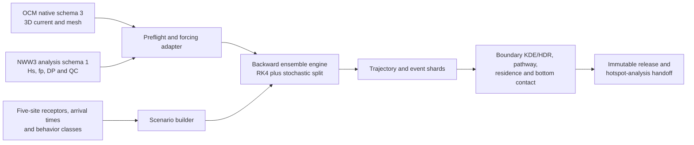

# Lagrangian Ensemble Backtracking

本專案實作「三、Lagrangian 系集逆向溯源」：針對完全沉沒於三維水體中的懸浮、沉降、上浮與近底廢棄物，以 CWA-OCM 三維海流、CWA-NWW3 波浪衍生的 Stokes drift、浮沉速度及次網格擴散，從受體位置與到達時間向過去建立條件式來源足跡。

目前狀態為 `reference_core_implemented_available_data_reconstruction_gated`。設定/preflight、native forcing adapters、
signed-time RK4、Stokes、擴散、巢狀邊界、scenario×member 分片、不可變 shard/checkpoint 與
核心聚合均已有可執行實作及測試；SERVER synthetic shard 驗證成功。研究團隊已將現存
OCM/NWW 凍結為正式的「2024–2025 全部可得資料」母體，`trial_ready`、partial month 與
供應者 metadata 不再是等待外部補件的阻擋。正式模擬尚未宣稱完成，是因 OCM 缺時重建
交叉驗證（或 gap-safe arrival/horizon manifest）、NWW 完整逐時 analysis、expanded A 與
數值／幾何衍生 gate 仍在實作。修正後的
證據與方法見[全部可得資料、時間重建與 A 區擴張決策](docs/10_available_data_time_reconstruction_and_a_expansion.md)。

## 工項邊界

本專案負責：

- 讀取 SERVER 上已前處理完成的 2024-2025 OCM `ocm_native` 與 NWW3 `nww3_analysis`。
- 沿用 A-D 四個 OCM/NWW forcing flow domains，對貢寮、龜山島、新竹、後灣與連江五個獨立研究站點，各建立 10 種浮沉行為、20 個三維受體與 50 個到達時間的完整情境設計；全案共 100 個 receptors。
- 實作三維 OCM 速度內插、有限水深 bulk Stokes drift、浮沉、水平與垂向擴散、逆時間積分及邊界事件。
- 產出軌跡、停止事件、邊界穿越、路徑密度、停留時間、底部接觸與 KDE/HDR 等可追溯產品。
- 以解析場、統計性質、正向-逆向合成案例、時步／系集／domain 敏感度與 checkpoint 重啟測試完成驗收。

本專案不負責：

- LBT runtime 不直接讀取原始 NetCDF／transfer archive；expanded A 與完整逐時 NWW analysis
  仍由相鄰前處理專案的正式入口產製，本專案負責版本、驗證與唯讀接線。
- 重做 `OCM-SVD-Analysis`，或實作 TRAP 分析。
- 對完全沉沒物體加入 windage；若未來擴充表面漂浮類別，必須另立方法版本。
- 在缺少先驗、觀測及調查努力量時，把條件式足跡宣稱為絕對來源機率、法律責任或因果歸因。
- 在缺少底床剪應力與再懸浮參數時，宣稱已完整模擬沉積-再懸浮動力。

## 上游資料

| 上游專案 | 正式輸入 | 本專案用途 |
|---|---|---|
| `OCM-Data-Preprocessing` | schema 3 `ocm_native/<flow_domain_id>/grid` 與 `months/YYYYMM` | 原生 SCHISM node/face/edge 拓撲、`hvel`、`vertical_velocity`、`zcor`、`elev`、`wetdry_elem`、`diffusivity` |
| `NWW-Data-Preprocessing` | schema 1 `nww3_analysis/<flow_domain_id>/months/YYYYMM` | 由完整 17,544 小時 native 軸對位靜態 OCM 格網的 `significant_wave_height`、`peak_frequency`、`peak_direction_raw_deg`、遮罩與 QC |
| `OCM-SVD-Analysis` | 參考其全部可得資料 canonical time、固定 z 垂向內插與 run manifest | 不把既有 SVD 模態直接當粒子 forcing；LBT 的 EOF-state-space 重建另立版本與驗證 |

正式路徑一律由環境變數或設定注入，程式內不得硬編碼：

```text
OCM_NATIVE_ROOT=/data/OCM-Preprocessed-Data/preprocessed/ocm_native
OCM_SURFACE_ROOT=/data/OCM-Preprocessed-Data/preprocessed/ocm_surface
NWW_ANALYSIS_ROOT=/data/NWW-Preprocessed-Data/preprocessed/nww3_analysis
LBT_OUTPUT_ROOT=<具足夠容量且經 preflight 確認的本機或 SERVER 路徑>
```

以上路徑已由 2026-08-17 SERVER 唯讀 preflight 確認；正式 release 仍須逐次保存實際目錄、月份、metadata、input fingerprint、容量及權限結果，避免已更新的上游資料被未察覺地混入續跑。

## 四個 flow domains、五個獨立研究站點

期中報告圖 2-17 與 `OCM-SVD-Analysis` 水柱聯合 SVD 使用 A-D 四個流場域；這是 forcing 與外層停止邊界的數量，不是本工項必須合併情境統計的理由。依使用者最終裁決，貢寮與龜山島雖共用 A 區 forcing，仍各自是完整且獨立的研究站點。

| 站點 | region | 共用 forcing／outer domain | 站點 local domain |
|---|---|---|---|
| 貢寮 | A | pilot 讀取 `northeast_taiwan_common_cache_v3`；正式版共用通過南擴閘門的新 domain version | anchor 半徑 25 km 與有效海域的交集；受體核心半徑 12.5 km |
| 龜山島西側 | A | pilot 讀取 `northeast_taiwan_common_cache_v3`；正式版共用通過南擴閘門的新 domain version | anchor 半徑 25 km 與有效海域的交集；受體核心半徑 12.5 km |
| 新竹外海 | B | `hsinchu_cache_v3` | 與 flow domain 相同 |
| 後灣海生館 | C | `houwan_nmmba_cache_v3` | 與 flow domain 相同 |
| 連江 | D | `lienchiang_common_cache_v3` | 與 flow domain 相同 |

因此不是「A 區 20 個 receptors 如何分配」，而是**貢寮 20 個、龜山島 20 個**，其餘三站點亦各 20 個，全案 receptor manifest 恰有 100 個三維 receptors。舊 SVD 候選框只保留 anchor provenance，不作正式 local domain；25 km local domains 允許重疊，但四套 forcing 不重複儲存或運算，情境、seed、事件、聚合與圖表仍以 `study_site_id` 分開。貢寮或龜山島的軌跡離開自己的 local domain 後只記錄主要入口事件並繼續使用共用 A 區 forcing；穿越另一站 local domain 不停止、不轉移 scenario 所屬，只另存為跨站連通診斷。兩站的最外層停止邊界始終是同一個 A 區 flow-domain open boundary。

SERVER preflight 顯示龜山島 25 km local boundary 到現行 A 區名目南界僅餘約 1.64 km，小於兩個約 1 km OCM surface／NWW 格點的預登錄餘裕。現行 v3 可供程式開發與 pilot；正式版採新 ID `northeast_taiwan_common_cache_v4_lbt_south_expanded`，南界 `24.480000°N`。龜山島 35 km geodesic 南緣約 `24.527152°N`，名目餘裕約 5.22 km；最終仍以實際 OCM/NWW 共同有效格網證明，不得只修改 bbox 名稱。完整幾何見[五站點情境與巢狀邊界設計基線](docs/08_design_baseline_and_derived_gates.md)，產製與時間方法見[全部可得資料決策](docs/10_available_data_time_reconstruction_and_a_expansion.md)。

## 核心方法決策

1. 五個站點各自採完整交叉：10 種浮沉行為 × 20 個三維受體 × 50 個到達時間，恰為 **每站點 10,000 個、A 區兩站合計 20,000 個、全案合計 50,000 個基礎情境**；計畫書「1,000 組」依使用者裁決視為誤植，不再列為可選設計。
2. OCM 以 native unstructured mesh 為正式三維 forcing，不另複製一套龐大的 48 層規則格網。水平內插使用 SCHISM face connectivity 的顯式三角形，不把 surface cache 的 SciPy Delaunay simplex ID 誤當原始 face ID。
3. 每個 flow domain 使用固定的公尺制局地投影；粒子步進、CFL、梯度、距離與 KDE 均在該投影計算，經緯度只作交換與展示。
4. 確定性 OCM + Stokes + 浮沉使用向量化 RK4；隨機擴散以獨立 operator split 的 Euler-Maruyama／Milstein 路徑處理，不把隨機增量塞入 RK4 stage。
5. backward baseline 對確定性 drift 作逆時間積分，擴散維持正變異；結果稱為 conditional footprint。嚴格 reversed-time SDE 僅能在獨立方法驗證後作敏感度版本。
6. Stokes drift 以 `Hs`、`Tp=1/fp`、峰值波向與有限水深分散關係計算 monochromatic bulk profile；深水公式須回復附檔式 (7)，並以 no-Stokes、深水式與有限水深式做敏感度。
7. 貢寮／龜山島採巢狀邊界：首次離開自己的 local domain 時記錄關注海域入口但繼續回溯，首次離開共用 A 區 flow domain 才停止；穿越另一站 local domain 只作非終止的跨站連通診斷。已知 OCM 缺時先經 approved reconstruction 或 gap-safe arrival window 處理，不作正常 baseline 停止點；`data_gap` 只保留給 manifest 外缺檔、重建失敗或 I/O 損毀。
8. 全期 UTC 先以 stable-sort/prefer-last canonicalization 去除 72 筆重複；OCM 17,124/17,544 個可用時次中的 420 個缺時，以單時次候選插值及 EOF-harmonic state-space smoother 做 blocked validation。NWW native 本身為 17,544/17,544 完整逐時資料，缺少的 analysis 時次直接重新格網化，不做統計補值。

## 情境與軌跡計數

計畫書列出的三因子套用於每一獨立研究站點：

```text
N_base_per_site = N_material × N_receptor_per_site × N_arrival_time
                = 10 × 20 × 50
                = 10,000

N_base_region_A = 2 × 10,000 = 20,000
N_base_total    = 5 × 10,000 = 50,000
```

`M_s` 是實作時為第 `s` 個基礎情境配置的獨立隨機實現數，不是計畫書另外指定的情境因子。若使用隨機擴散、受體位置微擾或 forcing ensemble，每一個 member 會產生一條可識別的粒子軌跡；全案總軌跡數為 `sum(M_s)`。所有情境使用相同 `M` 時，每站點為 `10,000 × M`、A 區為 `20,000 × M`、全案為 `50,000 × M`；完全確定性試驗則 `M=1`。正式 `M` 由主要統計量的 member-convergence 曲線決定，不能用 1,000 的敘述反推。

no-Stokes、不同擴散係數、domain 擴張等敏感度試驗以 `experiment_case_id` 另行編號，不混入上述每站點 10,000／全案 50,000 個基礎情境；完整運算成本須另乘實際執行的實驗案例數。

## 情境設計文獻備查

浮沉行為、到達時間、水平受體位置與垂向層位之所以分開列為情境因子，並非由 `10×20×50` 的算術式推得，而是由 Lagrangian 逆推研究所顯示的傳輸與歸因敏感性所支持。開放取用原文、紅框標註副本、引用頁碼、來源網址、授權提醒與 SHA-256 均存於 [情境設計文獻備查](data/scenario_design_literature/README.md)。該資料夾保留於主專案的本機 `data/`，依既有 `.gitignore` 資料管理規則不納入版本庫；紅框副本是閱讀輔助，原始 PDF 同步保留以供核對。

文獻支持「因子應被明確、可重現地分開處理」，不規定本計畫書的 10 個行為、20 個三維受體或 50 個到達時間必須採用的離散數目；這些數目與分層演算法仍以本專案已核定的設計基線為準。

## 資料流



## 專案結構

```text
.
├── AGENTS.md
├── README.md
├── pyproject.toml
├── uv.lock
├── configs/
│   ├── lagrangian_backtracking.example.yaml
│   └── upstream/ocm_flow_domains_lbt_a_v4.json
├── scripts/
│   └── prepare_a_v4_forcing.sh
├── src/lagrangian_backtracking/
│   ├── forcing.py, mesh.py, stokes.py, time_axis.py
│   ├── integrators.py, diffusion.py, engine.py, boundaries.py
│   ├── scenarios.py, runner.py, receptors.py, arrival_times.py
│   └── outputs.py, checkpoint.py, aggregation.py, preflight.py, cli.py
├── tests/
└── docs/
    ├── 01_requirements_traceability.md
    ├── 02_architecture_and_data_contract.md
    ├── 03_scientific_method_and_validation.md
    ├── 04_implementation_plan.md
    ├── 05_decisions_and_risks.md
    ├── 06_server_runbook_plan.md
    ├── 07_results_visualization_plan.md
    ├── 08_design_baseline_and_derived_gates.md
    ├── 09_implementation_audit_2026-08-19.md
    └── 10_available_data_time_reconstruction_and_a_expansion.md
```

## 安裝與目前可用命令

```bash
uv sync --frozen
uv run pytest -q -p no:cacheprovider
uv run lbt config-check --config configs/lagrangian_backtracking.example.yaml
uv run lbt synthetic-smoke --output /private/tmp/lbt-synthetic-smoke
uv run lbt validate-shard /private/tmp/lbt-synthetic-smoke
```

SERVER 唯讀全期 inventory：

```bash
uv run lbt preflight \
  --config configs/lagrangian_backtracking.example.yaml \
  --ocm-native-root "$OCM_NATIVE_ROOT" \
  --nww-analysis-root "$NWW_ANALYSIS_ROOT" \
  --output "$LBT_PROJECT_ROOT/work/input-inventory.json"
```

`behavior-manifest` 可產生已裁決的 10 種行為表。`lbt-run`、production Numba batch 與正式
aggregate/release CLI 尚受實作稽核第 4 節的資料、幾何與 pilot gate 約束，不能以目前
reference/synthetic CLI 取代。

A 區 v4 不需由使用者先行擴域。以下入口會先以 OCM 上游 CLI 做 24 月唯讀 dry-run；
確認後可用 `month 2025 1` 產製並驗證第一個完整月份，最後才以 `all` 逐月執行。NWW
每月明確使用 native `time_utc_ns.npy`，因此輸出是完整逐時 analysis，而非再次沿用 OCM
缺口。腳本不帶 `--overwrite`，既有月份只會先驗證後跳過。

```bash
bash scripts/prepare_a_v4_forcing.sh dry-run
bash scripts/prepare_a_v4_forcing.sh month 2025 1
bash scripts/prepare_a_v4_forcing.sh all
```

## 完成閘門與快速執行順序

| Gate | 優先序 | 通過條件 |
|---|---:|---|
| G0 輸入閘門 | P0，立即並行 | SERVER inventory、schema、月份、時間、單位、方向與磁碟可稽核；依既定演算法產生 local-domain、receptor、material 與 arrival manifests |
| G1 forcing sampler | P0 | 4D OCM 與 NWW3/Stokes 取樣通過解析場、遮罩、垂向、方向與邊界測試 |
| G2 數值核心 | P0，與 G1 可並行開發 | RK4、擴散、浮沉、海面／海床／海岸／開放邊界測試與 dt 收斂通過 |
| G3 模式完成 | P0 | backward ensemble、checkpoint、manifest、NumPy/Numba 一致性及已知來源合成驗證通過 |
| G4 全期批次 | P1，G3 後立即啟動 | 五站點各 10,000、合計 50,000 個基礎情境、資料衍生 `M` 及核心敏感度完成；失敗清單為零或具核准排除理由 |
| G5 分析交接 | P1，隨完成 shard 流式啟動 | conditional footprint、KDE/HDR、pathway、travel time、connectivity、bottom contact 與不確定性產品可供後續工項讀取 |

詳細工作拆解見[快速實作計畫](docs/04_implementation_plan.md)，資料介面見[架構與資料契約](docs/02_architecture_and_data_contract.md)，數值定義與驗證見[科學方法與驗證](docs/03_scientific_method_and_validation.md)，文獻支持的圖表組合見[成果呈現與學術視覺化規格](docs/07_results_visualization_plan.md)，最終設計裁決見[設計基線](docs/08_design_baseline_and_derived_gates.md)，缺時與擴區的最新方法基線見[全部可得資料決策](docs/10_available_data_time_reconstruction_and_a_expansion.md)。

## 立即下一步

1. 產生全期 canonical source index；由完整 NWW native 重建 17,544 小時 analysis，並以
   實際缺口形狀完成 OCM EOF-state-space blocked validation。`trial_ready`/partial 不再等待補件。
2. 產製 `northeast_taiwan_common_cache_v4_lbt_south_expanded`，並由 native mesh 生成五站 local/open-boundary 與各站
   20 個 receptors；貢寮、龜山島維持獨立 10,000 情境但共用 A forcing/outer boundary。
3. 在有效 coverage 上衍生五站各 50 個 arrival UTC，接通實值 reference pilot，完成
   wetdry/Kz、方向、dt/horizon/member convergence 與 known-source 驗證。
4. 補齊 chunked Numba production engine、mid-run checkpoint/restart 與 benchmark；通過
   NumPy 等價後才啟動五站 `50,000×M` baseline。
5. 已驗收 shard 隨完成隨即流式聚合，最後依既定學術視覺化規格產出圖表與 sidecar。
