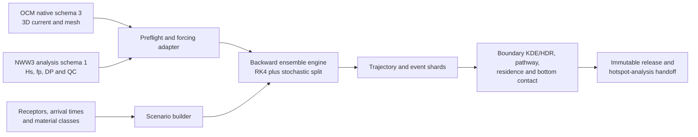

# Lagrangian Ensemble Backtracking

本專案實作「三、Lagrangian 系集逆向溯源」：針對完全沉沒於三維水體中的懸浮、沉降、上浮與近底廢棄物，以 CWA-OCM 三維海流、CWA-NWW3 波浪衍生的 Stokes drift、浮沉速度及次網格擴散，從受體位置與到達時間向過去建立條件式來源足跡。

目前狀態為 `planning`。本次建立的是可直接進入實作的專案骨架、資料契約、科學方法、驗證矩陣、快速執行關鍵路徑與風險閘門；尚未宣稱粒子模式或兩年正式模擬已完成。交付優先原則是「在不省略科學驗證與可重現性閘門的前提下，儘速完成」，不以日曆日期作為工作排序依據。

## 工項邊界

本專案負責：

- 讀取 SERVER 上已前處理完成的 2024-2025 OCM `ocm_native` 與 NWW3 `nww3_analysis`。
- 建立 10 種浮沉／物性、20 個受體位置與深度、50 個到達時間所構成的情境設計。
- 實作三維 OCM 速度內插、有限水深 bulk Stokes drift、浮沉、水平與垂向擴散、逆時間積分及邊界事件。
- 產出軌跡、停止事件、邊界穿越、路徑密度、停留時間、底部接觸與 KDE/HDR 等可追溯產品。
- 以解析場、統計性質、正向-逆向合成案例、時步／系集／domain 敏感度與 checkpoint 重啟測試完成驗收。

本專案不負責：

- 重做 OCM/NWW3 raw data 前處理，或直接讀取原始 NetCDF／transfer archive。
- 重做 `OCM-SVD-Analysis`，或實作 TRAP 分析。
- 對完全沉沒物體加入 windage；若未來擴充表面漂浮類別，必須另立方法版本。
- 在缺少先驗、觀測及調查努力量時，把條件式足跡宣稱為絕對來源機率、法律責任或因果歸因。
- 在缺少底床剪應力與再懸浮參數時，宣稱已完整模擬沉積-再懸浮動力。

## 上游資料

| 上游專案 | 正式輸入 | 本專案用途 |
|---|---|---|
| `OCM-Data-Preprocessing` | schema 3 `ocm_native/<flow_domain_id>/grid` 與 `months/YYYYMM` | 原生 SCHISM node/face/edge 拓撲、`hvel`、`vertical_velocity`、`zcor`、`elev`、`wetdry_elem`、`diffusivity` |
| `NWW-Data-Preprocessing` | schema 1 `nww3_analysis/<flow_domain_id>/months/YYYYMM` | 已對位 OCM 時空格網的 `significant_wave_height`、`peak_frequency`、`peak_direction_raw_deg`、遮罩與 QC |
| `OCM-SVD-Analysis` | 僅參考其資料載入、固定 z 垂向內插、run manifest 與 SERVER 執行慣例 | 不把 SVD 模態當作粒子 forcing，也不建立程式相依 |

正式路徑一律由環境變數或設定注入，程式內不得硬編碼：

```text
OCM_NATIVE_ROOT=/home/mustlab/data/OCM-Preprocessed-Data/preprocessed/ocm_native
OCM_SURFACE_ROOT=/home/mustlab/data/OCM-Preprocessed-Data/preprocessed/ocm_surface
NWW_ANALYSIS_ROOT=/home/mustlab/data/NWW-Preprocessed-Data/preprocessed/available_samples_v1/nww3_analysis
LBT_OUTPUT_ROOT=<具足夠容量且經 preflight 確認的本機或 SERVER 路徑>
```

以上是目前相鄰專案記錄的路徑基線；第一次 SERVER preflight 必須以實際目錄、月份、metadata、checksum、容量及權限重新確認。

## 核心方法決策

1. 基礎設計採完整交叉：10 種浮沉／物性 × 20 個受體 × 50 個到達時間，恰為 **10,000 個基礎情境**；計畫書敘述中的 1,000 依使用者裁決視為誤植，不再列為可選設計。
2. OCM 以 native unstructured mesh 為正式三維 forcing，不另複製一套龐大的 48 層規則格網。水平內插使用 SCHISM face connectivity 的顯式三角形，不把 surface cache 的 SciPy Delaunay simplex ID 誤當原始 face ID。
3. 每個 flow domain 使用固定的公尺制局地投影；粒子步進、CFL、梯度、距離與 KDE 均在該投影計算，經緯度只作交換與展示。
4. 確定性 OCM + Stokes + 浮沉使用向量化 RK4；隨機擴散以獨立 operator split 的 Euler-Maruyama／Milstein 路徑處理，不把隨機增量塞入 RK4 stage。
5. backward baseline 對確定性 drift 作逆時間積分，擴散維持正變異；結果稱為 conditional footprint。嚴格 reversed-time SDE 僅能在獨立方法驗證後作敏感度版本。
6. Stokes drift 以 `Hs`、`Tp=1/fp`、峰值波向與有限水深分散關係計算 monochromatic bulk profile；深水公式須回復附檔式 (7)，並以 no-Stokes、深水式與有限水深式做敏感度。
7. 停止條件除首次離開關注域外，還包括 forcing 起始時間、核定最大回溯期、資料缺口、無法定位的海陸／網格狀態及數值失敗，避免封閉流線無限運算。

## 情境與軌跡計數

基礎情境只計入計畫書列出的三個因子：

```text
N_base = N_material × N_receptor × N_arrival_time
       = 10 × 20 × 50
       = 10,000
```

`M_s` 是實作時為第 `s` 個基礎情境配置的獨立隨機實現數，不是計畫書另外指定的情境因子。若使用隨機擴散、受體位置微擾或 forcing ensemble，每一個 member 會產生一條可識別的粒子軌跡；總軌跡數為 `sum(M_s)`。所有情境使用相同 `M` 時才可簡寫為 `10,000 × M`；完全確定性試驗則 `M=1`。正式 `M` 必須由主要統計量的 member-convergence 曲線決定，不能用 1,000 的敘述反推。

no-Stokes、不同擴散係數、domain 擴張等敏感度試驗以 `experiment_case_id` 另行編號，不混入上述 10,000 個基礎情境；完整運算成本須另乘實際執行的實驗案例數。

## 資料流



## 專案結構

```text
.
├── AGENTS.md
├── README.md
├── configs/
│   └── lagrangian_backtracking.example.yaml
└── docs/
    ├── 01_requirements_traceability.md
    ├── 02_architecture_and_data_contract.md
    ├── 03_scientific_method_and_validation.md
    ├── 04_implementation_plan.md
    ├── 05_decisions_and_risks.md
    ├── 06_server_runbook_plan.md
    └── 07_results_visualization_plan.md
```

預定實作階段才新增 `src/lagrangian_backtracking/`、`tests/`、`scripts/`、`pyproject.toml` 與 `uv.lock`。依賴版本應在第一個可執行切片完成後鎖定，避免規劃文件先製造未驗證的環境契約。

## 完成閘門與快速執行順序

| Gate | 優先序 | 通過條件 |
|---|---:|---|
| G0 輸入閘門 | P0，立即並行 | SERVER inventory、schema、月份、時間、單位、方向、磁碟，以及 receptor／material 待決事項均有可稽核結果 |
| G1 forcing sampler | P0 | 4D OCM 與 NWW3/Stokes 取樣通過解析場、遮罩、垂向、方向與邊界測試 |
| G2 數值核心 | P0，與 G1 可並行開發 | RK4、擴散、浮沉、海面／海床／海岸／開放邊界測試與 dt 收斂通過 |
| G3 模式完成 | P0 | backward ensemble、checkpoint、manifest、NumPy/Numba 一致性及已知來源合成驗證通過 |
| G4 全期批次 | P1，G3 後立即啟動 | 10,000 個基礎情境、核定 `M` 及核心敏感度完成；失敗清單為零或具核准排除理由 |
| G5 分析交接 | P1，隨完成 shard 流式啟動 | conditional footprint、KDE/HDR、pathway、travel time、connectivity、bottom contact 與不確定性產品可供後續工項讀取 |

詳細工作拆解見 [快速實作計畫](docs/04_implementation_plan.md)，資料介面見 [架構與資料契約](docs/02_architecture_and_data_contract.md)，數值定義與驗證見 [科學方法與驗證](docs/03_scientific_method_and_validation.md)，文獻支持的圖表組合見 [成果呈現與學術視覺化規格](docs/07_results_visualization_plan.md)。

## 立即下一步

1. 同時啟動 SERVER 唯讀 preflight、20 個 receptor manifest 與 10 個 material manifest 的核定；三者互不等待。
2. 立即完成純 NumPy 的單 domain、單日、單 receptor 垂直切片與解析測試；不等待正式 receptor 才開始工程實作。
3. forcing sampler 與 RK4／擴散／邊界核心分成獨立工作流並行，介面以合成 fixture 固定。
4. 第一個端到端 pilot 通過後立即量測 member convergence，以最小合格 `M` 建立 10,000 情境的 shard 計畫並啟動 SERVER 批次。
5. 聚合與圖表採流式處理已完成 shard，不等待所有情境結束才開始成果製作。
