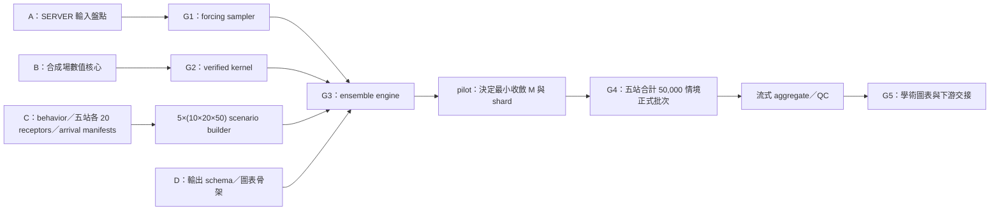

# 快速實作計畫

## 1. 執行原則

本工項以「儘速完成可驗收的兩年正式結果」為優先，不使用固定日曆日期安排工作。`timeline.txt` 僅保留原提案的上下游銜接背景；實際排序依資料與數值相依關係、風險及可並行程度決定。

加速不能省略輸入契約、數值收斂、隨機系集收斂、失敗率、seed/checksum 與科學措辭等驗收閘門。加速手段限於：並行開發、合成 fixture 解耦、端到端垂直切片、向量化／Numba、shard/checkpoint、流式聚合及避免不必要的全軌跡重複 I/O。

## 2. 並行工作流與關鍵路徑

A、B、C、D 四條工程工作流立即同時啟動。真正不可跳過的關鍵路徑為：可讀 forcing → 經驗證的 sampler／kernel → 可重啟的 ensemble engine → member convergence → 五站合計 50,000 情境正式批次 → 聚合與驗收。正式 receptor 或 SERVER inventory 尚未完成時，B、D 使用小型合成 fixture 前進，避免等待。

## 3. 工作分解與完成條件

### G0：輸入與科學契約

| ID | 優先序 | 工作 | 完成條件 | 可並行／依賴 |
|---|---:|---|---|---|
| LBT-000 | P0 | repository 與規格基線 | README、需求、架構、科學方法、快速計畫、風險、SERVER runbook、視覺化規格與 example config 一致 | 已完成規劃骨架 |
| LBT-001 | P0 | SERVER 唯讀 inventory | 逐 domain/month 列出 2024-2025 metadata、shape、dtype、time、coverage、bytes、status/cache kind 與 checksum 摘要 | 需要 SERVER 認證；與其餘工作並行 |
| LBT-002 | P0 | forcing 語意核對 | OCM `hvel/w/zcor/elev/wetdry/diffusivity` 與 NWW3 `Hs/fp/DP` 的單位、方向、mask、gap 與時間對位有證據 | LBT-001，可先讀相鄰專案契約 |
| LBT-003 | P0 | 科學 manifests | 依文件 08 生成恰好 10 個 behavior classes、每站 20／全案 100 個 receptors、每站 50 個 arrival-time 條件；每列含 site、region、版本、UTC、深度基準與衍生證據 | SERVER 資料與既定演算法；schema 可先行 |
| LBT-004 | P0 | 運算與儲存 preflight | 核定 output/scratch、檔案系統、可用 CPU/RAM、配額與原子發布方法 | LBT-001；不阻塞合成開發 |

**G0 完成條件：** 正式根路徑與輸入契約可稽核；未通過文件 08 衍生閘門的欄位會被 config validator 拒絕。G0 未完成仍可實作與測試，但不得啟動正式科學批次；這些 gate 由資料與測試產出，不需再向使用者徵詢方案。

### G1：forcing、網格與幾何

| ID | 優先序 | 工作 | 完成條件 | 依賴 |
|---|---:|---|---|---|
| LBT-101 | P0 | config/preflight CLI | normalized config hash、input inventory、decision-status 檢查與小記憶體讀取 | LBT-001/002；可先用 fixture |
| LBT-102 | P0 | CRS 與 geometry | 公尺制投影 round-trip、四個 flow domains、貢寮／龜山島 12.5/25 km wet-ocean polygons、重疊保留、boundary segment/arclength 與 receptor 深度 schema 測試 | LBT-003 schema |
| LBT-103 | P0 | SCHISM mesh locator | tri/quad 拆分、orientation、spatial index、barycentric 權重、coast/wetdry 支撐與 face provenance | OCM grid fixture |
| LBT-104 | P0 | OCM 4D sampler | x/y/z/t 線性場精確；surface/bed、layer bottom index、month window、gap 與無外插測試通過 | LBT-103、LBT-002 |
| LBT-105 | P0 | NWW3 sampler | mask-aware x/y/t 取樣、DP wave-from→propagation-to、Hs/fp QC 與 gap policy 通過 | LBT-002、LBT-102 |
| LBT-106 | P0 | 單日實值 QC | 速度／波向箭頭、垂向切片、有效率、海岸與缺值圖面無未解釋異常 | LBT-104/105、SERVER 資料 |

**G1 完成條件：** 合成與實值 sampler 均不會跨陸地、海床、時間缺口或無效 wave mask 靜默外插。

### G2：物理與數值核心

| ID | 優先序 | 工作 | 完成條件 | 依賴 |
|---|---:|---|---|---|
| LBT-201 | P0 | 有限水深 dispersion 與 Stokes | root residual、深／淺水極限、方向、深度衰減及 no/deep/finite cases 通過 | LBT-105；可先用解析輸入 |
| LBT-202 | P0 | signed-time RK4 | constant/rotation/shear、沉降／上浮、forward-backward closure 與預期階數通過 | 合成 velocity API |
| LBT-203 | P0 | stochastic split | constant Kh/Kz Brownian mean/variance、seed reproducibility、障壁處理通過 | LBT-202 |
| LBT-204 | P1 | 空變 diffusivity | Smagorinsky、K gradient drift、well-mixed/PDE 對照通過後才可升為 baseline | LBT-104、LBT-203 |
| LBT-205 | P0 | 邊界與粒子狀態 | local-entry/flow-exit/surface-regime/bed/coast/data-gap/max-age/numerical events 與步內 first crossing 通過 | LBT-102/103、LBT-202/203 |
| LBT-206 | P0 | dt controller | advective、vertical-layer、diffusive限制及 forcing-boundary substep；dt 減半指標收斂 | LBT-201..205 |

**G2 完成條件：** NumPy reference kernel 的解析、統計與邊界測試通過。空變 K 若尚未通過，只保留為敏感度，不阻塞已驗證的常數 K 基線。

### G3：完整情境、系集引擎與可重現執行

| ID | 優先序 | 工作 | 完成條件 | 依賴 |
|---|---:|---|---|---|
| LBT-301 | P0 | scenario builder | 五站點各 10×20×50 恰好 10,000 個、A 區 20,000、全案 50,000 個唯一 `scenario_id`；缺列、重列或未通過衍生 gate 的 manifest 立即失敗 | LBT-003 |
| LBT-302 | P0 | member/seed contract | `scenario_id`、`experiment_case_id`、`member_id` 分離；seed 與 worker/shard/restart 無關 | LBT-301 |
| LBT-303 | P0 | vectorized ensemble engine | chunked particle stepping、事件、ragged output 與一致的有效分母 | G1、G2、LBT-302 |
| LBT-304 | P0 | checkpoint/restart/merge | config/input/seed 綁定；中斷續跑不重複或遺漏 ID，合併前後等價 | LBT-303 |
| LBT-305 | P0 | Numba production kernel | 固定 seed 小案例與 NumPy 一致；吞吐與 RAM 優於或不劣於核定門檻 | LBT-303 |
| LBT-306 | P0 | 已知來源合成驗證 | 無擴散 closure、含擴散 footprint coverage、失敗案例與限制報告完成 | LBT-303..305 |
| LBT-307 | P0 | 模式技術審查 | 測試、benchmark、runbook、schema、限制與 immutable pilot run 可重建 | 全部 G3 工作 |

**G3 完成條件：** SERVER 上可從乾淨環境重建、執行、checkpoint、恢復與驗證代表案例；reference/production 一致，已知來源合成測試通過。

### Pilot：決定 `M`、shard 與資源配置

| ID | 優先序 | 工作 | 完成條件 | 依賴 |
|---|---:|---|---|---|
| LBT-401 | P0 | 代表性 pilot | 涵蓋 domain、季節／潮況、material、短／長 travel time；記錄 particle-step/s、CPU、RAM、read/write bytes 與失敗率 | G2；可先於完整 G3 執行 |
| LBT-402 | P0 | member convergence | 隨 `M` 增加，exit ranking、HDR、median travel time、path density 與 CI 在預先登錄門檻內穩定 | LBT-401 |
| LBT-403 | P0 | shard/checkpoint sizing | 以全案 50,000×M 外推 wall time、scratch、正式輸出、checkpoint 與 publish 成本；同時分列每站 10,000×M 與 A 區 20,000×M，保留容量安全緩衝 | LBT-401/402、LBT-004 |
| LBT-404 | P1 | 圖表垂直切片 | 代表 pilot 可生成 figure registry、核心圖、表與 sidecar，確認全期不需重讀不必要的原始軌跡 | LBT-401、視覺化規格 |

Pilot 決定 `M`、7/14/30/60 日最小穩定 horizon、Kh/Kz 與工程配置，不能把任一站點 10,000 個基礎情境降為 1,000，也不能把五站合併成一套 10,000。正式 baseline 原則上使用一致且已收斂的 `M`；若不同情境使用不同 `M_s`，必須預先登錄停止規則與統計權重，且證明不會扭曲跨情境比較。

### G4：2024-2025 正式批次與敏感度

| ID | 優先序 | 工作 | 完成條件 | 依賴 |
|---|---:|---|---|---|
| LBT-501 | P0 | release config freeze | 五站各 10×20×50 覆蓋、`M`、forcing、物理、巢狀邊界、seed、shard、容量與輸出版本全數 approved | G0、G3、Pilot |
| LBT-502 | P0 | baseline 50,000 情境 | 每站 10,000、A 區 20,000，且每個 scenario/member 均 completed 或有核准排除理由；checkpoint、資源與 failure manifest 完整 | LBT-501 |
| LBT-503 | P1 | 核心敏感度 | no/deep/finite Stokes、Kh/Kz、dt、domain、coast/bed policy 依預先登錄矩陣完成 | LBT-502 可按已完成 shard 交錯執行 |
| LBT-504 | P0 | run validation | schema、coverage、row/event count、checksum、seed、NaN/QC、停止原因與 denominator 全數驗收 | LBT-502/503 |

**G4 完成條件：** 五站點各 10,000、A 區 20,000、全案 50,000 個基礎情境與資料衍生 `M` 的正式 baseline 完成；核心敏感度與所有失敗／排除均可追溯。不得以單日、單 receptor 或未收斂 member 的 trial 代替。

### G5：流式聚合、學術成果與交接

| ID | 優先序 | 工作 | 完成條件 | 依賴 |
|---|---:|---|---|---|
| LBT-601 | P0 | raw aggregate | pathway unique-particle count、residence time、travel time、first/repeated bed contact、exit 與 failure density | 已完成且驗收的 shards 即可流式開始 |
| LBT-602 | P0 | conditional footprint | boundary segment/arclength、raw exit points、2D KDE、50/75/90% HDR、三 bandwidth 與質量 QC | LBT-601 |
| LBT-603 | P0 | connectivity 與不確定性 | source—receptor matrix、bootstrap CI、ranking stability、physics difference 與 convergence 結果 | LBT-601/602、LBT-503 |
| LBT-604 | P0 | 學術圖表與統計表 | 完成視覺化規格的核心圖表；固定尺度、分母、`n`、期間、單位、限制與 sidecar | LBT-601..603 |
| LBT-605 | P0 | immutable handoff | release manifest、schema、範例 reader、checksums、圖表 registry 與後續熱區工項輸入說明 | LBT-604 |

**G5 完成條件：** 數值、統計、圖表與資料產品可由 manifest 重製，且成果僅在證據允許的範圍內表述為「條件式來源足跡／相對來源權重」。

## 4. 最快可執行的第一個切片

第一個實作切片只包含足以打通最大風險介面的內容：

1. 建立 `pyproject.toml`、套件骨架、pytest 與小型合成 triangle/z-layer fixture。
2. `lbt-preflight` 讀單一 OCM/NWW3 月份的 metadata/time/shape，不載入完整大型陣列。
3. 純 NumPy 4D OCM sampler、constant-current backward RK4、單一 receptor 與事件輸出。
4. 常流解析解、無外插、時間缺口、海床／開放邊界測試。
5. 所有公開模組、函式、資料維度、座標正向、單位、缺值策略與限制均具完整繁體中文 docstring／註解，README 同步提供操作方法。

此切片完成後，Stokes、diffusion、scenario builder、Numba、SERVER I/O 可沿固定介面並行擴充。

## 5. 事件式審查節奏

- 每次合併前：unit tests、相關科學測試、中文註解／docstring 檢查、README/schema 影響檢查與 `git diff --check`。
- 每個 sampler／physics component 完成時：立即加入解析或統計回歸測試，不等待整合階段。
- 每個 gate：在乾淨環境重跑代表案例，保存命令、commit、lock hash、wall time、峰值 RAM、I/O 與輸出 checksum。
- 每個正式 shard 完成時：先驗證再進入 aggregate；不等待所有 shard 才發現 schema 或分母錯誤。
- G3、G4、G5：至少一位非核心作者審查數值方法與科學措辭。

## 6. 資源不足時的處理順序

每站 10,000、全案 50,000 個基礎情境已是正式範圍，不因 benchmark 結果自動改為每站 1,000 或全案 10,000。資源不足時依序採取：

1. 增加合理的 shard 並行度、向量化與 Numba 優化，並把 active I/O 放在本機 scratch。
2. 依已驗證的 output interval 降低儲存頻率，保留事件與聚合所需資訊；不得放寬積分 dt 或科學精度。
3. 先完成 baseline 與核心敏感度，將非核心動畫、探索性圖面及額外物理案例列為後續項目。
4. 若即使如此仍無法完成，由研究團隊明確變更範圍並建立新版 decision record；舊的每站 10,000／全案 50,000 情境要求不得被靜默改寫。
