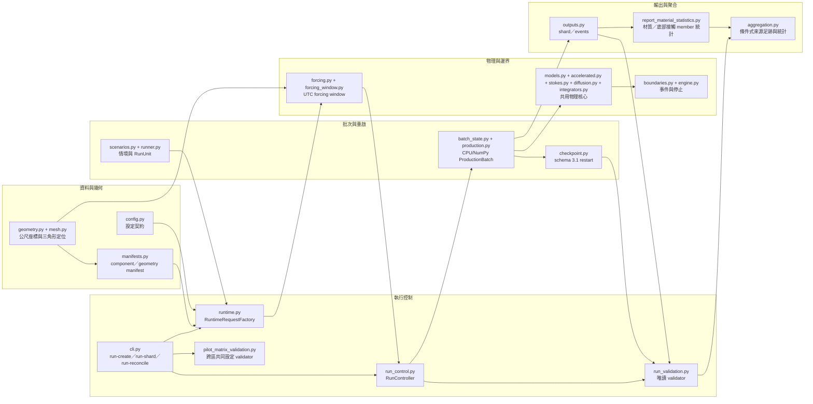
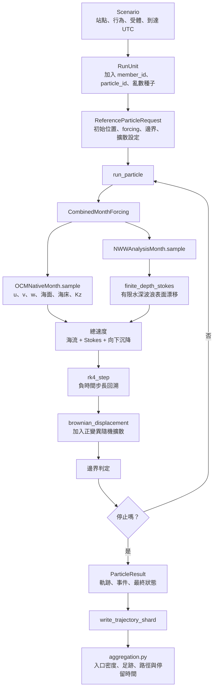
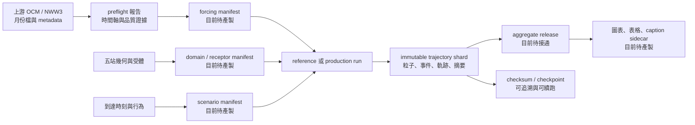

# 程式碼導覽、執行流程與工項計畫書追溯

> **閱讀提示**
> - 文件類型：原始碼、資料流程、測試與需求的交接導覽。
> - 它回答：每個模組負責什麼、資料如何流動，以及哪些工項已有可驗證實作。
> - 建議先讀：[文件總入口](../README.md)，再開啟[互動式架構圖](../source_code_architecture_map.html)。

## 1. 文件目的與閱讀方式

本文件是交接本專案時閱讀 `src/lagrangian_backtracking/` 的入口。它回答三個問題：

1. 每個程式模組在整個逆向溯源流程中負責什麼？
2. 從上游 OCM、NWW3 資料到最終來源足跡，資料如何流動？
3. 計畫書《工項3.pdf》（僅限持有原始資料的本機查閱；檔案未納入 Git，預期路徑為
   `data/工項3.pdf`）紅框中的研究要求，已由哪些程式與測試實作，哪些仍須以實際資料完成？

閱讀本文件時，必須區分三種證據，不能把它們混為「已完成」：

| 狀態 | 定義 | 可否宣稱為正式計畫成果 |
|---|---|---|
| **程式核心已驗證** | 原始碼已實作，並由解析案例、合成資料或單元測試檢查。 | 不可單獨宣稱；仍須接上正式資料與執行證據。 |
| **資料產製待完成** | 演算法已有，但正式的 flow domain、receptor、arrival 或 forcing manifest 尚未從 SERVER 資料產生。 | 不可。 |
| **正式成果待完成** | 尚未完成全期批次、收斂驗證、release、圖表或成果審查。 | 不可。 |

因此，這個 repository 現況正確描述是「可執行且經測試的 reference core、CPU/NumPy
ProductionBatch、schema 2 run-control 契約與 pilot／formal runtime」，不是「2024–2025
五站正式逆向溯源已完成」。目前 `initialize_run`／`initialize_formal_run`、
`RuntimeRequestFactory` 與 `open_run_controller` 已接通兩種模式；`lbt run-create`、
`lbt run-shard` 與 `lbt run-reconcile` 已提供對應入口。formal 由正式 config、approved
manifests、strict inventory topology／時間軸與逐 arrival flow 的 gap 支援 gate 控制，任何
證據不足都會在 forcing I/O 前 fail-closed。目前已有 A／B／C／D 第一次 24 小時
engineering pilot；A 的兩站使用 `no_stokes`，B／C／D 使用 `finite_depth_stokes`，因此
這些是可稽核的工程紀錄，不能當成同設定跨區比較或正式研究結果。完整數值、圖面狀態與
後續 gate 見 `../results/15_four_region_first_pilot_audit.md` 及
[實作與 SERVER 驗證稽核](../archive/09_implementation_audit_2026-08-19.md)。

### 1.1 BayTrace 可用部分整合界線

本專案只整合 BayTrace 可對應本地 CPU 執行的工程思路：CPU SoA／batch／chunk、每粒子可
重現亂數、SCHISM triangle hint、可暫停 engine，以及 schema 3.1 checkpoint/restart。未採用
GPU/CUDA、BayTrace raw `schout`／`bp` I/O、oil/weathering、droptime、共享記憶體
multiprocessing，也未放寬 backward round-trip 成功判定。`ptrack4a` 只保留為未來具備完整
相容 fixture 時的 golden reference；目前不把它當成正式驗證結果。

### 1.2 本工項的原始範圍與後續裁決

本文件僅對照計畫書紅框「三、Lagrangian 系集逆向溯源」：PDF 第 3–5 頁、印刷頁 28–30。該段包含：

- 原提案的 10 種沉降／上升行為，已依研究主持人裁決改為 10 種全非上浮的海廢材質／形狀代理；另含 20 個三維到達地點、50 個到達時間，以及離開關注區域的停止邊界；
- OCM 三維海流、NWW3 波浪導出的 Stokes 漂流與向下沉降速度之合成；
- 四階 Runge-Kutta 法、隨機漫步擴散與 Smagorinsky 水平擴散；
- 邊界穿越點的高斯核密度估計；
- 主要潛在來源路徑的視覺化。

計畫書中「每一處開放海域高達 1,000 組」與後續明列的 `10 × 20 × 50 = 10,000` 相互矛盾。依已記錄的使用者裁決，五個獨立研究站點各自採 10,000 個基礎情境：貢寮、龜山島、新竹、後灣、連江合計 50,000 個。每個情境若配置 `M` 個隨機系集成員，總軌跡數為各情境成員數之和；所有情境使用同一 `M` 時為 `50,000 × M`。裁決依據與完整需求文字見[需求追溯與範圍裁決](../foundation/01_requirements_traceability.md)。

## 2. 建議的閱讀順序

新接手者不應從數值迴圈開始逐行閱讀。建議依下列順序建立全貌，再進入細節：

1. [README](../README.md)：研究站點、情境計數、資料根目錄、目前可執行命令與正式閘門概覽。
2. 先開啟[互動式程式架構地圖](../source_code_architecture_map.html)建立全貌，再閱讀本文件第 3、4 節的五個程式群組與兩張流程圖。
3. [設定範例](../../configs/lagrangian_backtracking.example.yaml) 與 `config.py`：了解何者被鎖定為科學契約，何者尚不可用於正式發布。
4. `models.py`、`scenarios.py`、`runner.py`、`batch_state.py`：了解一條軌跡如何由站點、受體、到達時間、行為、成員唯一識別並進入 SoA 批次。
5. `forcing.py`、`forcing_window.py`、`mesh.py`、`stokes.py`、`diffusion.py`、`integrators.py`：了解每一時間步的速度如何取得與計算。
6. `boundaries.py`、`engine.py`、`production.py`：了解何時記錄事件、何時停止回溯，以及 CPU batch 如何呼叫共用單步 engine。
7. `runtime.py`、`run_control.py`、`run_locking.py`、`run_validation.py`、`pilot_matrix_validation.py`、`cli.py`：了解 pilot／formal request、workspace、鎖定、reconcile、跨區共同設定比較與命令列邊界。
8. `outputs.py`、`checkpoint.py`、`report_material_statistics.py`、`aggregation.py`：了解如何保存可追溯結果，以及如何產生材質／底部接觸、密度與路徑統計。
9. 對照 `tests/`：每一核心宣稱至少要有對應測試；測試通過表示程式邏輯符合該測試案例，不代表正式海域結果已產出。
10. 最後閱讀[科學方法與驗證](../foundation/03_scientific_method_and_validation.md)、[成果呈現與學術視覺化規格](../results/07_results_visualization_plan.md)與[實作稽核](../archive/09_implementation_audit_2026-08-19.md)。

## 3. `src` 的五個程式群組

下表是 `src/lagrangian_backtracking/` 的完整導覽索引。英文名稱為程式檔或欄位的既有名稱；右欄以中文說明資料意義與目前責任，避免必須從檔名猜測實作狀態。

| 群組 | 模組 | 主要輸入 | 主要輸出／責任 | 建議首先閱讀的公開函式或類別 |
|---|---|---|---|---|
| 資料與幾何 | `config.py` | YAML 設定 | 鎖定 4 個流場範圍、5 個站點、每站 10,000／全案 50,000 個基礎情境；正式發布時拒絕未補齊的證據。 | `ProjectConfig`、`load_config` |
| 資料與幾何 | `preflight.py`、`time_axis.py` | OCM／NWW3 月份 metadata 與 UTC 軸 | 唯讀盤點上游檔案、建立跨月唯一 UTC 軸、列出缺時與資料契約問題。 | `run_preflight`、`canonicalize_time_chunks` |
| 資料與幾何 | `input_derivation.py`、`input_horizon.py` | 已驗收產品、共同支援日數與逐筆到達時刻 | 建立不可覆寫的共同輸入；重新核對完整回溯窗與來源缺口，同一母體可綁定不同執行日數，保留共同情境身分。 | `build_input_derivatives`、`validate_generic_gap_payload`、`create_release_config` |
| 資料與幾何 | `horizon_suite.py` | 未綁定設定 template、horizons 回溯日數，以及已接受的 OCM schema 3 `ocm_native`／`ocm_surface` 與 NWW3 schema 1 `nww3_analysis` 產品根目錄 | 先以最大 horizon 篩選完整 gap-safe 到達母體，`inputs-build` 僅執行一次，再由同一份 `common-input` 產生多份 release config、validation 與 manifest／SHA-256；缺時不得補零或用最近值替代，formal 仍受既有 gate 約束。 | `build_horizon_suite`、`validate_horizon_suite` |
| 資料與幾何 | `geometry.py`、`mesh.py` | 經緯度、原始 OCM 節點與網格面 | 轉為公尺座標、建立局部分析區，並以原始三角形定位粒子。 | `DomainProjection`、`build_anchor_local_domain`、`NativeMesh.locate` |
| 資料與幾何 | `receptors.py`、`arrival_times.py` | 可長期濕潤的網格面、各時段資料品質指標 | 選取每站 5 個水平位置 × 4 個垂向層位，以及 48 個分層時刻加 2 個事件時刻。 | `select_horizontal_receptors`、`build_vertical_targets`、`select_arrival_times` |
| 資料與幾何 | `manifests.py` | 已產製的 component／geometry JSON 與 config resolver | 嚴格驗證 material、receptor、arrival、dynamic pair 與巢狀邊界；formal A 依 resolver 綁定當期 `formal_domain_policy` 與 v3 flow-domain ID，舊 `formal_domain_policy=expanded_domain_v1` 僅作相容讀取。 | `load_scenario_inputs`、`load_boundary_geometries` |
| 物理與邊界 | `models.py` | 無 | 定義所有模組共用的粒子狀態、速度樣本、品質旗標、事件與停止狀態。 | `ParticleState`、`VelocitySample`、`BoundaryEvent` |
| 物理與邊界 | `forcing.py`、`forcing_window.py` | OCM／NWW3 產品、時間、粒子位置與 UTC stage | 取樣海流、波浪、Stokes、沉降與擴散資料；以月份 lazy window 管理 resident cache。 | `CombinedMonthForcing`、`ForcingWindowManager` |
| 物理與邊界 | `accelerated.py`、`stokes.py`、`diffusion.py`、`integrators.py` | 欄位、波浪條件、擴散係數與速度取樣器 | 提供 OCM 內插加速、有限水深 Stokes、隨機擴散與逆向四階時間積分。 | `interpolate_ocm_support_numba`、`finite_depth_stokes`、`brownian_displacement`、`rk4_step` |
| 物理與邊界 | `boundaries.py`、`engine.py` | 提議的新粒子位置、局部／外層範圍、海面與海床資料 | 解析海岸、局部範圍、共同流場外框、海面與海床事件，控制單粒子回溯至停止。 | `resolve_horizontal_boundaries`、`resolve_vertical_boundaries`、`run_particle` |
| 批次與重啟 | `scenarios.py`、`runner.py` | 行為、受體、到達時刻、主亂數種子 | 建立 10 × 20 × 50 唯一情境，展開 `RunUnit` 與每情境 `M` 個成員，固定順序切 shard。 | `build_scenarios`、`derive_member_seed`、`plan_scenario_shards`、`iter_run_units` |
| 批次與重啟 | `batch_state.py`、`production.py` | `ParticleState`、`ScenarioShard`、request factory 與 reference engine 單步介面 | 以 SoA 保存狀態，執行 CPU/NumPy active compaction、chunking、scatter 與可暫停 batch。 | `ParticleBatch`、`ProductionBatch`、`run_production_shard` |
| 批次與重啟 | `checkpoint.py` | 粒子 execution、觀測、事件、RNG state 與 binding | 以 schema 3 immutable segment + compact 保存可重啟系集狀態；沿 SHA-256 chain 驗證 cursor、identity、binding 與輸入繫結，並保留 schema 2.x 唯讀 loader。 | `write_execution_checkpoint`、`load_execution_checkpoint` |
| 執行控制 | `cli.py`、`runtime.py` | 命令列參數、run workspace、manifest、config 與 forcing roots | 提供 `run-create`、`run-shard`、`run-reconcile`；依 run kind 建立 `RuntimeRequestFactory` 與 controller，formal 先通過 strict inventory／manifest gate。 | `main`、`initialize_run`、`initialize_formal_run`、`RuntimeRequestFactory`、`open_run_controller` |
| 執行控制 | `provenance.py`、`run_control.py` | 部署指紋、run plan/progress、ProductionBatch 與 checkpoint/output | 綁定程式來源、immutable plan、schema 3 segment checkpoint、atomic progress、lock topology、shard 執行與 reconcile。 | `collect_code_provenance`、`initialize_run_workspace`、`RunController` |
| 執行控制 | `run_locking.py`、`run_validation.py` | lock file、validator 輸入與 checksum | 以 Unix `flock` 保護互斥；唯讀驗證 lifecycle、identity、order、checkpoint/output 與工程摘要。 | `acquire_run_lock`、`validate_run`、`benchmark_report` |
| 執行控制 | `pilot_matrix_validation.py` | 兩個以上 pilot run root 的 `run_plan.json` 與 `normalized_config.json` | 唯讀比較跨區共同設定與 deployment provenance；允許明示的站點／domain／arrival／scenario、輸入／幾何 binding 與區域 Kh／Kz／Smagorinsky cap 差異。它不判定 run lifecycle、不讀 forcing／trajectory，也不是 formal gate。 | `validate_pilot_matrix`、`canonical_pilot_matrix_json` |
| 輸出與聚合 | `outputs.py` | 完成的 `ParticleResult` 清單 | 原子寫出粒子摘要、事件、軌跡一維陣列與檢查資料；拒絕覆寫或不完整結果。 | `write_trajectory_shard`、`validate_trajectory_shard` |
| 輸出與聚合 | `aggregation.py` | 已驗證的事件與軌跡 | 計算邊界密度、二維條件式足跡、高密度區、路徑訪格比例、停留時間與跨站連通；正式成果仍待資料 release。 | `conditional_kde_2d`、`pathway_residence_grid`、`boundary_arclength_histogram` |
| 輸出與聚合 | `report_material_statistics.py` | `Scenario`／`ScenarioStratum` 與一次串流的 `ParticleResult` | 依 `study_site_id × material_id` 產生有效 member 分母、首次海床接觸／沉積 member count 與 fraction；沉底漁具優先層僅是定性排序，不改速度或來源先驗，重複接觸按 member 去重，基線不含再懸浮。 | `MaterialStatisticsAccumulator`、`build_material_statistics` |

### 3.1 五群組不是五套獨立程式

五群組的關係如下。箭頭表示文件化資料／控制語意，而非同一個 Python 函式必定直接呼叫另一個函式；實際相對 `import` 請以互動式架構地圖為準。



可直接引用的靜態圖檔如下：

- [圖 1 PNG：src 模組關係與資料流](../output/figures/source_code_module_relationship.png)
- [兩頁 PDF：圖 1 與圖 2](../output/pdf/source_code_flow_diagrams.pdf)
- [互動式 HTML：程式架構追蹤地圖](../source_code_architecture_map.html)

互動式地圖中的實線由腳本 `scripts/render_source_code_architecture_map.py` 直接掃描目前
`src/lagrangian_backtracking/` 的相對匯入產生；虛線則是本文件為了說明資料與控制流程而登錄的
語意連線。兩者分開呈現，避免把「資料流向」誤讀成 Python 函式必然直接呼叫。點選模組後，
右側會列出它實際引用的模組、引用它的模組、主要入口與原始碼連結；若要追到函式級行為，
仍須從入口函式進入原始碼並對照 `tests/`。

## 4. 一條粒子軌跡實際怎麼走

下圖以一個「站點 × 行為 × 受體 × 到達時刻 × 系集成員」為例。每條粒子的 `study_site_id` 從建立到輸出都不會因為穿越其他站點而改變；這是貢寮與龜山島共用 A 區流場但維持獨立統計的關鍵。



此圖的單頁 PNG 為[圖 2：單一粒子逆向溯源的處理流程](../output/figures/single_particle_backtracking_flow.png)。兩張圖的可重製來源是 `scripts/render_source_code_flow_diagrams.py`；在具備 ReportLab 的環境執行下列命令即可重新產製 PDF：

```bash
uv run --with reportlab python3 scripts/render_source_code_flow_diagrams.py \
  --output docs/output/pdf/source_code_flow_diagrams.pdf
```

### 4.1 邊界判定的閱讀重點

`boundaries.py` 與 `engine.py` 是最容易誤讀、也是最影響成果解釋的部分。其規則如下：

| 粒子事件 | 程式行為 | 對來源解釋的意義 |
|---|---|---|
| 首次離開自己的 `local_domain` | 寫入 `LOCAL_DOMAIN_FIRST_EXIT`，通常繼續回溯。 | 這是移入該關注海域的主要入口診斷。 |
| 貢寮／龜山島穿越另一站的 local domain | 寫入跨站進入／離開診斷事件，不改變站點、不停止。 | 顯示可能的共同水動力連通，不能混入自站入口分母。 |
| 離開共同 A 區或 B–D 各自流場的開放邊界 | 寫入 `FLOW_DOMAIN_OPEN_EXIT` 並停止。 | 這是外層條件式潛在來源的邊界穿越點。 |
| 撞到海岸，而非標記為開放水域的邊界段 | 寫入 `COAST_CONTACT` 並停止。 | 不是外海來源入口，不能放入開放邊界核密度估計。 |
| 到達海床、離開表層規則、資料起點、最大回溯時間或資料／數值失敗 | 寫入各自停止狀態。 | 必須與成功離域分開統計，不能靜默從分母刪除。 |

這套巢狀邊界設計針對已裁決的需求：貢寮與龜山島各自有 20 個 receptors 和 10,000 個基礎情境、local domain 可重疊、forcing 與最外層停止邊界則共用 A 區。完整幾何設計見[五站點情境與巢狀邊界設計基線](../foundation/08_design_baseline_and_derived_gates.md)。

## 5. 紅框計畫書到原始碼、測試與成果的追溯表

下表是交接與驗收時的主表。它以計畫書的實際條目為列，而不是以程式檔名為列，因此可由左向右檢查「研究要求 → 程式 → 測試 → 正式成果」。

| 計畫書條目 | 主要原始碼 | 已有測試或可執行證據 | 目前狀態與仍需完成事項 |
|---|---|---|---|
| 10 種非上浮海廢材質／形狀代理 | `scenarios.BASELINE_BEHAVIORS`、`Behavior`、`config.ProjectConfig`、`CombinedMonthForcing` | [test_cli_smoke.py](../../tests/test_cli_smoke.py)、[test_config.py](../../tests/test_config.py) 與 [test_scenarios.py](../../tests/test_scenarios.py) 驗證 10 筆、iOcean 分類唯一、欄位完整及速度全部嚴格小於 0。 | **目前 v3 design 承接既有 non-rising material contract，程式契約已驗證。** 目前速度仍為 `provisional_proxy`；正式 material manifest 尚待發布，現地物性校準屬後續 gate。 |
| 20 個三維 receptors／每站 | `geometry.py`、`mesh.py`、`receptors.py` | [test_receptors.py](../../tests/test_receptors.py) 驗證長期濕潤水平選取與 4 個有效垂向層。 | **資料產製待完成。** 演算法已具備；五站正式 local/open-boundary/receptor manifests 尚未由實際網格產生。 |
| 50 個到達時間／每站 | `arrival_times.select_arrival_times`、`scenarios.ArrivalTime` | [test_checkpoint_arrivals.py](../../tests/test_checkpoint_arrivals.py) 驗證 48 個分層時刻加 2 個事件時刻。 | **資料產製待完成。** 尚未以完整資料時間軸產生五站正式 50 個 UTC 與回溯可用範圍證據。 |
| 每站 `10 × 20 × 50 = 10,000`，全案 50,000 | `config.ProjectConfig`、`scenarios.build_scenarios`、`validate_baseline_coverage` | [test_config.py](../../tests/test_config.py)、[test_scenarios.py](../../tests/test_scenarios.py) 拒絕縮減計數並驗證 50,000 個唯一情境。 | **程式契約已驗證。** 尚待把正式受體、到達時間和行為表交叉成不可變的 scenario manifest。 |
| 離開關注區域的邊界停止 | `BoundaryGeometry`、`resolve_horizontal_boundaries`、`resolve_vertical_boundaries`、`run_particle` | [test_boundaries_engine.py](../../tests/test_boundaries_engine.py) 驗證自站、他站、外層、海岸、海面／海床與時間步內交點。 | **邏輯已驗證；正式幾何待完成。** A 區本期依 `formal_domain_policy=v3_local20km_20260909_v1` 重建 20 km local／12.5 km receptor core，並以 `runtime_stage_fail_closed_no_expansion_v1` 逐 RK4 階段驗證 forcing；五站開放水域邊界與新 geometry identity 仍須由完整母體建置驗收。 |
| 公式（6）：海流 + Stokes + 向下沉降的總平流速度；完全沉沒不加 windage | `forcing.CombinedMonthForcing`、`stokes.py` | [test_mesh_forcing.py](../../tests/test_mesh_forcing.py)、[test_stokes.py](../../tests/test_stokes.py) 驗證 OCM／NWW 取樣、波向與深淺水極限。 | **程式核心已驗證。** 尚未以 SERVER 全期正式 forcing 實跑與檢查單位、濕乾語意及共同有效遮罩。 |
| 公式（7）：由波高、週期、波向與波長計算 Stokes 漂流 | `solve_wave_number`、`finite_depth_stokes`、`deep_water_stokes` | [test_stokes.py](../../tests/test_stokes.py) 驗證色散關係殘差、深水極限與波向轉換。 | **程式核心已驗證。** baseline 的波浪資料版本、no-Stokes／深水／有限水深敏感度尚未以實值資料產出。 |
| 公式（8）：逆向四階 Runge-Kutta 時間積分 | `integrators.rk4_step`、`engine.run_particle` | [test_integrators_diffusion.py](../../tests/test_integrators_diffusion.py)、[test_boundaries_engine.py](../../tests/test_boundaries_engine.py) 驗證負時間步長只取反一次、四個中間點與離域處理。 | **程式核心已驗證。** 正式的最小／最大時間步長和時間步收斂試驗尚待 pilot 決定。 |
| 公式（9）：隨機漫步擴散 | `brownian_displacement`、`split_rk4_brownian_step` | [test_integrators_diffusion.py](../../tests/test_integrators_diffusion.py) 驗證變異數為 `2KΔt`。 | **程式核心已驗證。** 正式水平、垂向擴散係數及系集成員數 `M` 尚待收斂試驗決定。 |
| 公式（10）：Smagorinsky 水平擴散 | `smagorinsky_horizontal_diffusivity` | 候選函式已實作；目前測試套件尚無針對解析剪切、旋轉不變性或上下限的專屬驗證。 | **僅候選功能，尚未完成驗證，更不是已發布 baseline。** 真實速度梯度、上下限、均勻混合性和敏感度尚未接入正式批次。 |
| 公式（11）：邊界穿越點核密度估計 | `conditional_kde_2d`、`boundary_arclength_histogram` | [test_outputs_aggregation.py](../../tests/test_outputs_aggregation.py) 驗證密度正規化、高密度區、邊界分母與原始計數。 | **程式核心已驗證。** 還沒有由正式全期軌跡產生的入口密度、來源足跡、頻寬敏感度與信賴區間。 |
| 視覺化主要潛在來源路徑 | `aggregation.py`、`source_pathway_release.py` 提供繪圖資料／成果包；[成果呈現與學術視覺化規格](../results/07_results_visualization_plan.md) 定義 F01–F12 圖組。 | B／C／D 已有 engineering pilot 四圖；A 的舊 NFS 發布未完成；另有聚合函式測試與成果包 round-trip 測試。 | **工程 pilot 圖面已具備，但正式圖表仍待完成。** 需先完成資料、情境、收斂、accepted input、全期批次與聚合 release，才可產出正式圖表。 |

### 5.1 為什麼「有 KDE 函式」不等於「已完成來源路徑圖」

`conditional_kde_2d` 只能把已驗證的邊界交點轉為平滑密度格網。要能在報告中說「主要潛在來源路徑」，至少還需要：

1. 五站正式的受體、到達時刻與情境清單；
2. 經資料可用範圍及時間步收斂驗證的軌跡；
3. 明確的有效成員分母、原始交點數、停止原因與頻寬敏感度；
4. 與路徑訪格比例、停留時間、旅行時間及不確定性並列的圖表；
5. 可追溯的 run manifest、輸入資料指紋與圖說 sidecar。

因此，本專案目前的 KDE 實作是正式成果的必要條件，但尚非充分條件。

## 6. 如何由一個正式 run 追溯到圖表

正式執行時，每一層都應保留可交叉檢查的資料。下圖也標示目前缺少的實務產物。



交接者應以以下問題逐步查核：

| 需要確認的事實 | 應查看的檔案或程式 | 合格證據 |
|---|---|---|
| 使用的是哪一版上游資料？ | `preflight` JSON、輸入 manifest、`preflight.py` | schema、月份、UTC coverage、品質旗標、檔案指紋與路徑 token。 |
| 為何此站有 10,000 個基礎情境？ | scenario manifest、`scenarios.py`、`config.py` | 10 行為 × 20 受體 × 50 到達時刻，無缺列與無重複。 |
| 為何有 `10,000 × M` 條軌跡？ | run manifest、`runner.py` | 每個情境的 member 數、主亂數種子、成員識別碼與收斂決策。 |
| 一條軌跡何時停止？ | events Parquet、`boundaries.py`、`engine.py` | 每個停止原因的 raw count、分母與海岸／開放邊界段識別碼。 |
| 密度圖代表什麼？ | aggregate release、`aggregation.py`、圖說 sidecar | 原始 `n`、有效分母、密度定義、頻寬、格網、座標系統與 HDR 水準。 |
| 圖表能否重製？ | figure registry、產製命令、data sidecar | 來源 aggregate checksum、run ID、commit、設定與輸入 hash。 |

## 7. 現況的完成判定與下一個可驗收里程碑

### 7.1 已完成且可立即閱讀、測試的部分

- `src` 的 reference core、合成資料端到端 smoke、結果 shard 驗證與本輪完整 suite 的 377 項測試（2026-08-28）；此數字是本機測試，不是 SERVER 測試。
- 跨欄位的科學計數契約：A 區有兩個獨立站點、五站各 10,000、全案 50,000；程式拒絕將此契約縮減為 1,000。
- OCM 原始網格內插、NWW3 波浪取樣、Stokes 漂流、四階逆時間積分、隨機擴散、巢狀邊界事件、情境成員識別、輸出與聚合的可測試語意。

### 7.2 尚未完成，且不能以程式碼存在替代的部分

`config.py` 的 `assert_formal_release_ready` 會刻意阻擋正式批次，直到下列項目全部具備：

1. OCM 缺時重建或 gap-safe 到達／回溯窗 manifest；
2. NWW3 完整逐時 analysis manifest；
3. 本期 A v3 flow-domain policy（12.5 km receptor core、20 km local domain）與五站 domain、開放邊界、受體 manifests；A 區 formal config 須明示 no-expansion runtime-stage 封閉失敗契約，且完整母體的 OCM surface arrival 支援與 runtime forcing root 必須通過驗證；
4. 五站各 50 個到達時刻、10 種非上浮材質／形狀代理及 50,000 個 scenario manifest；
5. 由 pilot 決定的 `M`、擴散係數、時間步長、最大回溯期、批次大小與 checkpoint 間隔；
6. 實值 pilot、全期 SERVER batch、aggregate release 與 F01–F12 圖表。

這些不是要求使用者再提供科學資料；依既有決策，應由現有 2024–2025 資料、既定演算法和 pilot 驗證產生。詳細待辦與不可放寬的閘門見[實作與 SERVER 驗證稽核](../archive/09_implementation_audit_2026-08-19.md)第 4 節。

### 7.3 下一個可驗收里程碑

下一個正確的里程碑不是直接跑 50,000 × `M` 條軌跡，而是建立一組可審查的「實值 pilot 證據包」：

1. A 區 v3 policy 的 forcing／幾何／受體／到達時刻 manifests、OCM surface 完整 arrival 母體支援，以及 OCM native／NWW analysis 的逐 RK4 階段封閉失敗契約；B-D 原有 expanded-domain 敏感度另依各自 manifest 驗證；
2. 代表性站點與行為的 reference pilot shards；
3. 時間步長、回溯期、擴散係數與成員數的收斂結果；
4. local entry、outer exit、海岸與資料停止原因的摘要；
5. 最少一組 F02、F03、F04、F05、F10、F12 的可重製草圖與資料 sidecar。

pilot／formal runtime 已接通現有 CPU/NumPy batch；上述條件通過後，才可凍結正式
production run 設定、在 SERVER 執行全期 batch，並把 `aggregation.py` 的資料產品產製為
計畫書所要求的主要潛在來源路徑成果。因此「程式可正式執行」已達成，但「正式 release
artifacts、SERVER 科學批次與成果」仍未完成。

## 8. 維護規則

日後新增或修改 `src` 模組時，必須同步更新本文件中對應的：

1. 第 3 節模組群組與主要責任；
2. 第 4 節資料流程或邊界規則（若影響粒子語意）；
3. 第 5 節計畫書追溯表中的程式、測試與完成狀態；
4. 第 6 節正式 run 的新增或變更資料產品；
5. README 的文件索引與相關測試。

未附測試或可執行證據的程式，不得在第 5 節標記為「程式核心已驗證」；未產生實值資料產物與圖表的功能，不得標記為「正式成果完成」。
