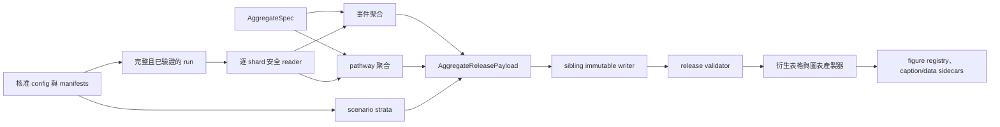

# 聚合發布與 SERVER 正式執行實作計畫

> **閱讀提示**
> - 文件類型：軌跡聚合、不可變發布與 SERVER 驗收計畫。
> - 它回答：固定 run 完成後，統計產品與圖表輸出如何建立、核對及發布。
> - 建議先讀：[成果呈現規格](07_results_visualization_plan.md)，再核對[實作狀態](../implementation_status.md)。

## 1. 目的與完成定義

本計畫固定軌跡 run 完成後的聚合、不可變發布、圖表產製與 SERVER 驗收流程。BayTrace
可套用的範圍限於 CPU 資料布局、作用中粒子壓縮、分塊、亂數流與 checkpoint/restart
觀念；不納入其 GPU／CUDA 實作。

本機沒有正式 OCM 與 NWW 資料，因此本機只能證明下列工程能力：

- 正式 CLI、schema、checksum、原子發布及 fail-closed validator 可執行。
- 合成 constant-flow 或小型 fixture 可完成 run、checkpoint/restart、聚合與 release smoke。
- 合成圖只驗證資料流與圖面產製器，不得稱為五站研究成果。

只有在 SERVER 讀取已驗收 OCM schema 3 `ocm_native` 與 NWW3 schema 1
`nww3_analysis`，完成正式 run、聚合與驗證後，才可產生及稱呼真實 F03–F12、T03–T05
科學結果。F01、F02、T01、T02 雖以設計與 manifest 為主，正式版本仍須綁定同一個
SERVER release 的 run ID、輸入雜湊與資料期間。

## 2. 核心架構裁決

### 2.1 聚合成果是 run 的 sibling release

`validate_run` 對 run root 採固定拓撲；將 `aggregates/` 或 `figures/` 寫進既有 run 會使
run 變成 invalid。因此聚合成果必須發布為同一父目錄下的 sibling directory，不修改
原 run：

```text
work/runs/
├── formal-2024-2025/                 # immutable trajectory run
└── formal-2024-2025.aggregate-v1/    # immutable aggregate release
```

writer 只可在共同父目錄建立 `.partial-<uuid>`，完成 schema、shape、dtype、row count、
關聯品質檢查與所有 SHA-256 後才原子改名。既有目標檔案、目錄或 symbolic link 一律拒絕，
不得就地覆寫。

### 2.2 release 不依賴 GPU

正式追蹤與聚合基線維持 CPU／NumPy。分片 reader 每次只載入一個已驗證 trajectory
shard；事件與 pathway 統計在記憶體內合併，不一次載入全部 ragged trajectories。
後續若增加 Numba，必須保留 NumPy reference 與定量一致性證據；本計畫不以 Numba 或
GPU 作為 SERVER 可執行的前置條件。

### 2.3 科學語意

所有發布欄位、圖名與表名只能使用「條件式來源足跡」或「相對來源權重」。在沒有先驗、
似然與觀測驗證前，不得稱為絕對來源機率、確定來源或因果歸因。資料缺口、數值失敗、
海岸、乾點、域外與物理零值必須維持不同狀態；不得以零值互相替代。

## 3. 資料流與介面



正式 build 必須先要求 `validate_run(require_complete=True)`。每個 shard 再核對 plan range、
scenario 順序、完整 RunUnit identity、trajectory manifest SHA-256 及 particle／observation／
event count。這是刻意的重複驗證，避免聚合層信任已被外部修改的輸出。

`AggregateSpec` 明示每站公尺制 AEQD 中心、網格大小、邊界弧長分箱、共同 travel-age
分箱、三尺度 KDE、HDR 層級及 bootstrap 設定。這些數值是研究設計輸入，不由程式猜測。
`local_equals_flow=true` 時，local 與 outer 角色引用同一個 flow segment ID，但保留兩種
不同分母與報表語意。

## 4. 模組與修改範圍

| 模組 | 預定責任 | 主要輸入 | 主要輸出 |
|---|---|---|---|
| `run_control.py` | 抽出不依賴檔名的 plan／progress 文件驗證，供 source snapshot 重驗 | 已解析 JSON mapping | 防禦性文件快照 |
| `run_validation.py` | 完整 run 的逐 shard 唯讀輸入邊界 | run、可選 external checkpoint root | `ValidatedTrajectoryShard` iterator |
| `runtime.py` | 抽出不開 forcing 的 static run binding，讓執行與聚合共用同一套 config／manifest／inventory gate | run、原 config、可選 external checkpoint root | immutable `ValidatedRunStaticInputs` |
| `aggregate_spec.py` | 由已驗證邊界與明示研究參數建立規格 | geometry bundle、metric centers、numeric policy | immutable JSON `AggregateSpec` |
| `aggregate_release_records.py` | shard binding 與 scenario 分層列 | `ScenarioInputs` | `AggregateShardBinding`、`ScenarioStratum` |
| `aggregate_release_payload.py` | 跨事件、pathway、scenario、shard 的記憶體內不變量 | spec 與合併後聚合 | `AggregateReleasePayload` |
| `aggregate_release_codec.py` | 固定檔案拓撲與 NumPy／Parquet 編解碼 | payload | 未發布 release directory payload |
| `aggregate_release.py` | source-run binding、manifest、原子發布與 validator | run、payload、destination | sibling release 與驗證報告 |
| `event_aggregation.py`、`streaming_aggregation.py` | 單次迭代的固定記憶體 reducer；每個 shard 驗證後立即累加，不保存歷史 chunk | 單一 event/pathway chunk 串流 | 完整且不可變的全 run aggregate |
| `aggregate_pipeline.py` | 逐 shard 聚合、reducer 累加與 payload 建立 | 完整 run、config、spec | 可交給 writer 的 payload |
| `reporting.py` | F01–F12、T01–T06、registry 與 sidecars | 已驗證 release；必要時加 run trajectory | 靜態圖、表與可重繪資料 |
| `cli.py` | 可重建操作入口 | 明示 paths 與研究參數 | JSON 摘要與 shell exit code |

主要實作由 `gpt-5.6-luna`、`reasoning_effort=max` 的執行 worker 完成；主代理負責本計畫、
介面裁決、git diff 審查、回歸分析與獨立測試。若 worker 未在限定時間落檔，任務需中斷並
拆成更小 write set，不以長時間等待代替實作。

## 5. 固定 release 檔案拓撲

schema 1 採固定根層檔名，validator 不接受 manifest 指向任意路徑。不同站點與邊界長度
使用索引表、offset 與串接陣列表示，避免動態子目錄及 object dtype：

```text
<run_id>.aggregate-v1/
├── aggregate_manifest.json
├── aggregate_spec.json
├── source_run_plan.json
├── source_run_progress.json
├── source_normalized_config.json
├── source_input_inventory.json
├── shard_bindings.parquet
├── scenario_strata.parquet
├── site_index.parquet
├── boundary_index.parquet
├── source_receptor_index.parquet
├── cross_site_counts.parquet
├── outcome_counts.parquet
├── site_denominators.parquet
├── receptor_denominators.parquet
├── age_bin_edges_seconds.npy
├── site_cell_offsets.npy
├── local_first_exit_count.npy
├── outer_first_exit_count.npy
├── bed_first_contact_count.npy
├── bed_repeated_contact_count.npy
├── data_gap_failure_count.npy
├── numerical_failure_count.npy
├── pathway_unique_particle_count.npy
├── pathway_residence_time_seconds.npy
├── pathway_first_passage_age_histogram.npy
├── boundary_edge_offsets.npy
├── boundary_bin_edges_m.npy
├── boundary_bin_offsets.npy
├── boundary_arclength_raw_count.npy
├── boundary_travel_age_histogram.npy
├── source_receptor_raw_count.npy
└── source_receptor_travel_age_histogram.npy
```

所有計數陣列使用非負 `int64`；停留時間、格線與年齡使用有限 `float64`；格網軸順序固定
為 `(y_cell, x_cell)`，first-passage age histogram 是 `(cell, age_bin)` 的串接表示。
Parquet 列必須使用固定 schema 與 deterministic sort order。manifest 為每個 payload
保存 size、SHA-256，並依檔案型別保存 shape/dtype 或 row count/column contract。

### 5.1 表格欄位與排序契約

codec 不得依 Python mapping 插入順序或 Parquet reader 的實作細節推斷語意；每張表的
欄位集合與資料列順序固定如下。所有 `*_index`、offset 與 count 都是非負 `int64`；動態
初始條件欄位是唯一可 nullable 的科學欄位，而且同一 scenario 列仍須符合全有或全無。

| 檔案 | 固定欄位與順序 | 資料列排序 |
|---|---|---|
| `shard_bindings.parquet` | `shard_index` 加上 `AggregateShardBinding` 全部欄位 | payload tuple 原順序；`shard_index=0..N-1` |
| `scenario_strata.parquet` | `scenario_index` 加上 `ScenarioStratum` 全部欄位 | payload tuple 原順序；`scenario_index=0..N-1` |
| `site_index.parquet` | `site_index`、`study_site_id`、`analysis_region_id`、四個 grid bounds、`x_cell_count`、`y_cell_count`、`cell_start_offset`、`cell_stop_offset`、五個 metric CRS 欄位、`scenario_count`、`total_member_count`、`valid_member_denominator`、`pathway_input_particle_count`、`pathway_input_interval_seconds`、`pathway_allocated_interval_seconds` | `study_site_id` 字典序；每站必須只有一個 `analysis_region_id` |
| `boundary_index.parquet` | `boundary_index`、`study_site_id`、`boundary_kind`、`boundary_segment_id`、`segment_length_m`、`edge_start_offset`、`edge_stop_offset`、`bin_start_offset`、`bin_stop_offset` | `(study_site_id, boundary_kind, boundary_segment_id)` |
| `source_receptor_index.parquet` | `source_receptor_index` 加上 `SourceReceptorAggregateKey` 四欄 | `(study_site_id, receptor_id, boundary_kind, boundary_segment_id)` |
| `cross_site_counts.parquet` | `source_study_site_id`、`target_study_site_id`、`unique_member_count` | `(source_study_site_id, target_study_site_id)`；單站 release 可為零列 |
| `outcome_counts.parquet` | `study_site_id`、`outcome`、`count` | `(study_site_id, outcome)` |
| `site_denominators.parquet` | `study_site_id`、`valid_member_denominator`、`total_member_count` | `study_site_id` |
| `receptor_denominators.parquet` | `study_site_id`、`receptor_id`、`valid_member_denominator` | `(study_site_id, receptor_id)` |

`site_index` 中的 scenario、event 與 pathway 粒子數必須互相一致；`pathway_*_seconds` 是
路徑時間守恆所需的秒數標量，不得由 residence array 反推後覆蓋。`segment_length_m` 必須
精確等於 `AggregateSpec` 的公尺制邊界長度，而非用最後一個 edge 近似取代。

### 5.2 串接陣列與 offset 契約

- `site_cell_offsets` 長度是 `site_count+1`，從 0 開始嚴格遞增；第 i 站的六個事件格網、
  pathway unique 與 residence 都以 C-order 將 `(y_cell,x_cell)` 攤平後放在同一段
  `[offset_i, offset_{i+1})`。first-passage 則把 `(y,x,age_bin)` 攤平，該站片段為
  `[offset_i*age_bin_count, offset_{i+1}*age_bin_count)`。
- `boundary_edge_offsets` 與 `boundary_bin_offsets` 長度都是 `boundary_count+1`。前者切分
  每列的邊界 edges；後者切分 raw count 的 s-bin。travel-age 陣列以 `(s_bin,age_bin)`
  C-order 攤平，因此第 i 列使用
  `[bin_offset_i*age_bin_count, bin_offset_{i+1}*age_bin_count)`。
- `source_receptor_raw_count` 長度等於 source-receptor 列數；travel-age 陣列長度等於
  `source_receptor_count*age_bin_count`，第 i 列使用固定連續 age-bin 片段。
- 所有 offset 最後一值必須精確等於其對應串接軸長度；空片段、倒退、越界、shape 乘積
  不符或整數乘法超過 `int64` 一律 fail closed，不可截短、padding 或轉置修補。

### 5.3 codec 與 manifest 的責任界線

`encode_aggregate_release_payload` 只把完整 `AggregateReleasePayload` 轉成上述九表與十八
陣列；函式開頭必須以全部欄位重建 payload，防止 frozen dataclass 被低階手段竄改後繞過
constructor。`decode_aggregate_release_payload` 接受已驗證的 manifest metadata、
`AggregateSpec` 與固定產品，先驗證每張表 exact 欄位／型別／順序及所有 offset，再重建
`EventAggregateChunk`、各站 `StreamingPathwayAggregate`，最後重建
`AggregateReleasePayload` 作第二層跨產品驗證。

payload 的 run kind、experiment case、M、六個 provenance SHA-256 與全域
`input_particle_count` 保存於 `aggregate_manifest.json` 的固定 metadata；它們不可藏在任意
Parquet metadata。manifest validator 須先驗證固定根層拓撲、一般檔案與 symbolic link
政策、size/SHA-256、Parquet 欄位／列數、NumPy dtype／shape，再交給 decoder。如此檔案
完整性、編碼契約及科學資料容器三層失敗能分別定位，且 validator 不會在 checksum 尚未
通過前信任檔案內容。

codec 以 frozen `AggregateReleaseMetadata` 作為 manifest 與 decoder 間的 typed boundary，
固定包含：schema version、run ID/kind、experiment case、`members_per_scenario`、config 與
checkpoint binding hash、四個 source JSON SHA-256、aggregate spec 的 source/canonical
SHA-256、全域 input particle count，以及 shard/scenario/site/boundary/source-receptor 五種
row count。`metadata_from_payload` 也必須先重建 payload；decoder 不接受任意 dict 並自行
猜型別。所有 count 與表列／offset 尾端再次 exact cross-check，spec 的兩個 hash 必須與
載入物件一致。

#### 5.3.1 decoder 的公開介面與還原順序

公開介面固定為 `metadata_from_payload(payload) -> AggregateReleaseMetadata` 與
`decode_aggregate_release_payload(metadata, aggregate_spec, products) -> AggregateReleasePayload`。
metadata 欄位名稱固定為 `schema_version`、`run_id`、`run_kind`、`experiment_case_id`、
`members_per_scenario`、`config_hash`、`checkpoint_input_binding_hash`、四個
`source_*_sha256`、`aggregate_spec_source_sha256`、`aggregate_spec_canonical_sha256`、
`input_particle_count`、`shard_row_count`、`scenario_row_count`、`site_row_count`、
`boundary_row_count` 與 `source_receptor_row_count`。所有 row/count 欄位必須是非負且可無損
表示為 signed `int64` 的原生 Python `int`；`members_per_scenario`、input particle count 與
前兩種 row count 必須大於零，三種拓撲 row count 也不得為零。hash 一律是 64 位小寫
SHA-256，ID／run kind 的規則與 payload 相同，不做寬鬆字串轉型。

decoder 先以全部正式欄位重建 metadata、`AggregateSpec` 與
`EncodedAggregateProducts`，再依下列順序還原；每一步都必須先驗證 exact 欄位集合與欄位
順序、Python scalar 型別、row count、排序、連續 index 與 duplicate key，不能只在最後
依賴 constructor 偶然發現錯誤：

1. `shard_bindings` 與 `scenario_strata` 以列順序重建公開 record；只有 scenario 的動態
   初始條件欄位可為 `None`，而且仍由 `ScenarioStratum` 執行整組有值／整組缺值政策。
2. `site_index` 必須依 `study_site_id` 字典序且 `site_index=0..N-1`；其格線、投影、站點
   scenario/member 分母與秒數 scalar 必須與 spec、strata、metadata 及 site denominator
   表一致。`site_cell_offsets` 必須和每列 start/stop 完全相等，再依 C-order 還原六個
   `SiteEventGridCounts` 陣列與三個 pathway 陣列；pathway x/y edges 只能由 spec 的公尺制
   grid canonical 重建，不另存或猜測。
3. `boundary_index` 依 `(site, kind, segment)` 排序，兩套 offset 同時核對 index row、邊界
   edges、raw count 與 travel-age 長度；每段 edges 必須等於 spec 建立的 canonical edges，
   `segment_length_m` 必須等於 spec，不接受近似或尾端推導。
4. `source_receptor_index` 依 `(site, receptor, kind, segment)` 排序；第 i 列只可切取一個
   raw count 與固定 `age_bin_count` 個 travel-age 值，並拒絕 duplicate 或未知 join key。
5. 四張 count／denominator 表逐列建立 typed key，不允許重複、額外或缺少零列；最後以
   metadata 的 input particle count 建立 `EventAggregateChunk`，再建立每站
   `StreamingPathwayAggregate` 與最外層 `AggregateReleasePayload`。最外層 constructor 的
   exact zero topology、分母、shape 與 age 軸檢查是第二層驗證，不能由 decoder 略過。

decode 成功後，重新 encode 的九表與十八陣列必須逐列、逐值完全等於 canonical 輸入；
這個 round-trip equality 是 writer／reader 測試與 release validator 的必要 gate，而不是
可選的 smoke test。

### 5.4 writer 的來源綁定與原子發布

writer 介面必須同時接收完整 source run、原始 `aggregate_spec.json` 及已建立的 payload；
不能只拿 payload 後自行重建來源 JSON。發布前再次要求 source run 通過
`validate_run(require_complete=True)`，並逐 bytes 核對及複製：

| release 檔案 | source | 必須等於 payload 的綁定 |
|---|---|---|
| `source_run_plan.json` | `<run>/run_plan.json` | `source_run_plan_sha256` |
| `source_run_progress.json` | `<run>/run_progress.json` | `source_run_progress_sha256`，且 lifecycle 為 COMPLETE |
| `source_normalized_config.json` | `<run>/normalized_config.json` | `source_normalized_config_sha256` |
| `source_input_inventory.json` | `<run>/input_inventory.json` | `source_input_inventory_sha256` |
| `aggregate_spec.json` | caller 明示的已驗證 spec 檔 | `AggregateSpec.source_sha256`，且載入物件與 payload spec 完全相同 |

writer 在重新驗證與擷取上述 source snapshot 時，必須以既有 `locks/run_gate.lock` 取得
non-blocking exclusive lock；若仍有 shard worker 或 reconcile 持鎖，立即拒絕發布，不等待也不
讀取一半更新中的 progress。鎖內除核對 plan／progress 外，還要依 plan 順序逐筆比對 payload
的 shard binding：scenario 半開區間、粒子數與 output token 必須等於 plan／COMPLETE
progress，`trajectory_manifest_sha256` 必須等於當下 source output 的普通非 symbolic-link
`manifest.json` 位元組。這個檢查只證明 payload 綁定哪一批已驗證軌跡，不重新聚合，也不能
把 synthetic 工程資料提升為真實 OCM／NWW 科學成果。

writer／reader／validator 的公開介面固定為：

```python
write_aggregate_release(
    *,
    source_run_root: str | Path,
    aggregate_spec_path: str | Path,
    payload: AggregateReleasePayload,
    destination: str | Path | None = None,
    checkpoint_root: str | Path | None = None,
) -> Path
validate_aggregate_release(path: str | Path) -> dict[str, object]
read_aggregate_release(path: str | Path) -> AggregateReleasePayload
```

省略 destination 時使用 source run 的同層 `<run_id>.aggregate-v1`；若明示 destination，
仍必須經 lexical 與 resolved parent 雙重檢查後精確等於該路徑。validator 回傳內容必須
JSON-safe，固定包含 `valid`、不含絕對路徑的 `errors` 與可攜 `summary`；reader 先完成同一套
完整驗證再回傳重建 payload，失敗只拋固定訊息的 `ValueError`。validator 不能回傳已載入的
NumPy、Arrow 或 payload 物件，避免 CLI JSON 序列化失敗及無意中持有大型記憶體。

目標必須和 source run 位於同一 parent，名稱精確為 `<run_id>.aggregate-v1`；既有檔案、
目錄或 symbolic link 一律拒絕。writer 在該 parent 建立唯一 `.partial-<uuid>`，以固定 Arrow
schema 寫 Parquet、`allow_pickle=False` 寫 NumPy，再複製五個來源檔。所有 payload 都落檔
後建立 manifest，接著對 partial 直接呼叫完整 release validator；只有 validator 成功才以
`os.replace(partial,target)` 原子發布。任何失敗只清理由本次 writer 建立且名稱已保存的
partial，不搜尋或刪除其他 partial，也不改動 source run。

`aggregate_manifest.json` 不保存 source run、forcing、checkpoint 或 SERVER 的絕對路徑；
metadata 只保存可攜識別、上述 digest、全域 count 及每個固定檔案契約。各 Parquet 契約含
exact column names、Arrow logical types、nullable flags 與 row count；各 NumPy 契約含
`dtype.str`、shape、size 及 SHA-256。validator 不採用 manifest 提供的任意路徑，而是逐一
讀取 schema 固定檔名，避免 path traversal 或外部檔案替換。

manifest 根物件只能包含 `schema_version`、`metadata` 與 `files`。`metadata` 必須由
`AggregateReleaseMetadata.to_dict()` 產生；`files` 必須恰好列出五個來源／spec JSON、九個
Parquet 與十八個 NPY，不含 manifest 自身。共同欄位是 `kind`、`size_bytes` 與 `sha256`：
JSON 的 kind 為 `json` 且不可有其他欄位；Parquet 另有 `row_count` 與 ordered
`fields=[{name,type,nullable},...]`；NPY 另有一維 `shape`、`element_count` 與固定 little-endian
`dtype`（`<i8` 或 `<f8`）。root、file contract 與 field contract 都採 exact key set；未知欄位
視為 schema 不相容，不得忽略後繼欄位繼續讀取。manifest 以 UTF-8、排序鍵、緊湊分隔符、
`ensure_ascii=False` 及單一尾端換行寫入，並拒絕 duplicate JSON key、NaN 與 Infinity。

validator 的執行順序固定為：先核對根目錄的 33 個固定普通檔案與 symbolic link 政策，
再嚴格解析 manifest，接著逐檔核對 contract、size 與 SHA-256；checksum 全部通過後才能
開啟來源 JSON、Parquet 與 NPY。四份 source run JSON 均以拒絕 duplicate key 與非有限值
的 parser 讀取，plan／progress 再分別交給 `validate_run_plan_document`、
`validate_run_progress_document`，並呼叫 `_cross_check_plan_progress`。plan 的 run kind、
experiment case、M、config hash、checkpoint binding、scenario／particle／shard count，及
progress 的 COMPLETE shard 集合，必須與 metadata、shard bindings、scenario strata 完全
一致；plan 內 normalized config／input inventory 的 file contract 也必須等於 release 所
保存的 source bytes。完成這些來源綁定後，才由固定 reader 與 codec decoder 重建 payload，
並執行 encode-back exact equality。公開 validator 只回傳 JSON-safe 摘要；內部 inspection
可在同一次驗證中把 payload 交給公開 reader，避免再次讀檔造成不必要的競態窗口。

### 5.5 Parquet 與 NPY 的實體型別

writer 不使用 `pyarrow.Table.from_pylist` 的推斷 schema。每張表皆由 codec 欄位順序建立
explicit `pyarrow.Schema`：索引、offset、scenario time/index、year、wet/dry、particle、
observation、event、count 與 denominator 一律為 `int64`；座標、速度、深度、格線邊界、
秒數與 segment 長度一律為 `float64`；ID、分類、路徑、SHA-256、投影與狀態一律為
non-null UTF-8 string。`ScenarioStratum` 的 `initial_*` 動態條件是唯一 nullable 欄位群，
其中座標／深度／alpha 為 nullable `float64`、face/time/wetdry index 為 nullable `int64`、
semantics/month/time-origin 為 nullable UTF-8 string；codec constructor 仍負責全有或全無，
Arrow nullability 不能被當成部分缺值的許可。

所有 NPY 必須以 `numpy.save(..., allow_pickle=False)` 寫入已 canonical 的一維 C-contiguous
`int64` 或 `float64` array；reader 使用 `numpy.load(..., allow_pickle=False)`，不得接受
object array、memory-mapped 外部 path、壓縮 archive 或在讀取時轉型。manifest 記錄每個
NPY 的精確 dtype 字串、shape、size 與 SHA-256；Parquet 記錄 row count、ordered columns、
Arrow field type 與 nullability。空的單站 `cross_site_counts.parquet` 仍須以明示 schema 寫出
零列檔案，不能省略檔案或產生沒有欄位的 Parquet。

Parquet writer 參數也屬 schema 1 重現契約：固定 column order、`compression="zstd"`、
`use_dictionary=False`、`write_statistics=True`，且不保存任意 pandas metadata。驗證以語意
schema、列值與 payload SHA-256 為準；不同 pyarrow patch 版本若造成實體 bytes 不同，不會
把不同檔案誤判為同一 checksum，但 decoded/re-encoded logical products 仍必須 exact equal。

## 6. CLI 契約

### 6.1 streaming aggregate pipeline

`aggregate_pipeline.py` 的公開建構函式固定接收 source run、原始 config、已驗證
`AggregateSpec` 與可選 external checkpoint root，不接 OCM/NWW raw path，也不重新平流：

```python
build_aggregate_release_payload(
    *,
    source_run_root: str | Path,
    config_path: str | Path,
    aggregate_spec: AggregateSpec,
    checkpoint_root: str | Path | None = None,
) -> AggregateReleasePayload
```

為避免 `aggregate_pipeline.py` 複製 physical runtime 的設定與 manifest 判斷，`runtime.py`
需先把 `_open_run_controller` 中「尚未接觸 forcing root」的部分抽成
`load_validated_run_static_inputs(...) -> ValidatedRunStaticInputs`。回傳物件保存防禦性 plan
快照、`ProjectConfig`、`ScenarioInputs` 與 `BoundaryGeometryBundle`；它不得建立
`RuntimeRequestFactory`、`ForcingWindowManager` 或開啟 OCM／NWW 陣列。controller 與 aggregate
builder 都呼叫同一 helper，並分別在 helper 通過後才建立 forcing runtime或讀取既有 trajectory，
避免兩條路徑對 formal／pilot、normalized config、component hashes、geometry hashes 與 inventory
產生不同判斷。

函式先以 plan 的 run kind 載入 config 與 component manifests，要求目前 normalized config、
config hash、scenario stable IDs、順序、動態初始條件與 immutable run plan 完全相等；正式
模式沿用 `load_scenario_inputs(..., formal=True)` 的五站 50,000 scenario gate。四個 source
JSON digest 從 source run 的普通檔案 bytes 計算，不能從 caller 傳入；run ID、experiment
case、M、checkpoint input binding hash 與 config hash只取已驗證 plan，不接受重複 CLI
參數造成第二個真相來源。

每次迭代一個 `ValidatedTrajectoryShard`，立即建立 `AggregateShardBinding`；事件聚合只使用
該 shard 的 scenarios/results，再交給單次迭代的 `EventAggregateAccumulator`。pathway 先依
結果的 `study_site_id` 分組，各站只在本 shard 非空時呼叫
`stream_pathway_first_passage`，再交給各站獨立的 `StreamingPathwayAccumulator`；站點
x/y edges 只可由 AggregateSpec 的公尺制矩形與 cell size canonical 建立。兩種 reducer
都必須在加入當前 chunk 前完成 topology、軸線、守恆與溢位檢查，結束時再以不可變公開
資料類別重建結果；任何失敗都封閉 reducer，不允許 caller 捕捉後繼續使用半完成狀態。

流程不得保存所有 shard results、所有 chunk list，也不得反覆以
`(accumulated, current)` 兩兩合併並重複複製整個格網。峰值記憶體只包含當前 shard、
一份全域 event accumulator、五份 pathway accumulator 與當前待驗 chunk；計算成本與
分片數呈單次累加，而不是隨每次合併重寫既有全域格網。

迭代結束後必須確認 shard bindings 連續覆蓋全部 scenario、每站至少收到一個 pathway
chunk、實際 shard／scenario／particle count 與 plan 完全相同，再建立
`AggregateReleasePayload`。若聚合途中中斷，不發布任何 release；再次執行會從 immutable
complete trajectory run 重新串流，而 trajectory 本身仍由既有 checkpoint/restart 保證可
續跑。schema 1 不保存半完成 aggregate checkpoint，避免把未綁定全域零拓撲的部分統計
誤認為完成產品；若 SERVER pilot 顯示重聚合時間不可接受，再另行設計版本化 reducer
checkpoint，而不偷偷擴充 schema 1。

預定正式入口：

```text
lbt aggregate-spec-create --run ... --config ... --destination ... [明示統計參數]
lbt aggregate-build --run ... --config ... --spec ... --destination ... [--checkpoint-root ...]
lbt aggregate-validate <release>
lbt report-build --release ... --destination ...
lbt report-validate <report-release>
```

`aggregate-spec-create` 不得從範例設定猜測 grid、bandwidth、age bins 或 bootstrap 次數；
未經 PI／研究團隊核定的數值必須由命令列或核准 spec 明示。`aggregate-build` 重新載入
原 config 與 component／geometry manifests，核對 normalized config、canonical hashes、
scenario table 與 run plan；不能只依 trajectory 表中缺少 season/tide 的欄位推測分層。

CLI 成功輸出 JSON 只包含可攜識別、計數、hash 與相對產品名稱；SERVER forcing root、
checkpoint root、帳密及其他絕對部署路徑不得寫入 release manifest 或錯誤訊息。

## 7. 相容性與主要風險

1. **run root 固定拓撲**：任何 nested aggregate 都會使 run invalid；以 sibling release 解決。
2. **shard 重複**：聚合容器無法只靠總數辨識同一 shard 重複加入；release payload 必須以
   plan range 與唯一 shard binding 證明全域不重疊及完整覆蓋。
3. **分層資料不足**：run scenario table 沒有 season、tide、材料描述與動態初始條件；正式
   build 必須重載並 hash-bind 原 component manifests。
4. **大量資料記憶體**：只保留單一 trajectory shard；event/pathway 使用常數記憶體或分層
   reducer。不可把 50,000×M 全部軌跡 materialize。
5. **浮點與整數溢位**：所有計數加總先用 Python `int` 預檢 `int64`；停留時間使用有限
   高精度加總與守恆容許值，不允許 silent wrap 或 Infinity。
6. **研究數值未核定**：schema 與 CLI 可先完成，但真實圖表不可自行填入 grid、KDE、M、
   回溯期或 bootstrap 決策。
7. **跨 experiment case**：單一 release 綁定一個 experiment case；F11 比較需由多個已
   驗證 release 建立上層 comparison product，不能在同一 run 混合分母。
8. **SERVER 鎖與檔案系統**：NFS／NAS 的 `flock`、atomic rename、memory-map 與容量必須在
   登入 SERVER 後做代表性 preflight；本機通過不能替代該證據。

## 8. 驗證與測試矩陣

### 8.1 本機必要證據

- dataclass、schema、hash、path traversal、symbolic link、unknown file 與 overwrite 測試。
- 多 shard plan order、range、RunUnit identity、checksum、count 與 external checkpoint root。
- aggregate spec 的負座標向外對齊、segment length、`local_equals_flow` 與 deterministic bytes。
- event/pathway 合併的 shape、age axis、分母、守恆、overflow 與輸入不可變性。
- sibling release 的 partial crash window、checksum tamper、Parquet／NumPy dtype/shape、重建
  payload 及 validator JSON-safe error。
- synthetic run 的 uninterrupted 與 checkpoint/restart release checksum／數值等價。
- wheel 安裝後以 console CLI 重做 synthetic end-to-end smoke。
- 完整 pytest、Ruff、`git diff --check` 與互動式架構地圖 source-generated equality。

### 8.2 SERVER 必要證據

- 目標 Python／uv lock、CPU、RAM、scratch、output、NFS 鎖與 atomic rename preflight。
- 真實 OCM/NWW 月份、schema、時間軸、gap-safe/full-product 與 geometry manifest 驗證。
- 小型代表性 pilot：正常完成、人工中止、resume、reconcile、run/release validator。
- 依 pilot 量測確認 shard size、active chunk、checkpoint cadence、I/O 與容量，不改變科學設定。
- 正式五站 50,000 base scenarios × 核定 M；各 shard 與 release checksum 完整。
- F01–F12、T01–T06 的 registry、caption/data sidecars、有效 `n`、分母、單位、CRS、CI/HDR、
  已知限制與不可用項目原因。

## 9. 階段完成順序

1. 完成 records、payload、codec、writer 與 validator。
2. 完成 static input binding 與逐 shard aggregate pipeline。
3. 接上 CLI，完成 synthetic immutable release smoke。
4. 完成表格／圖表產製器；本機只驗證 synthetic 版與 unavailable 狀態，不宣稱真實結果。
5. 同步 README、資料契約及互動式架構地圖，完整回歸與 wheel smoke。
6. 再取得 SERVER 登入資訊，執行真實 pilot、restart、正式 batch、聚合與成果驗收。

## 10. 最早規劃 task 的承接稽核

已重新核對 `codex://threads/01a01428-061b-73c1-aff7-a8f987642c54`。下列內容是正式
範圍的一部分，必須持續由目前實作與 SERVER 驗收證明，不能因先完成 synthetic pipeline
而省略：

- 四個 forcing domains 對應五個獨立研究站點；每站 20 個 receptor templates、50 個
  arrival times、1,000 個 dynamic receptor×arrival pairs 與 10,000 個基礎 scenarios，
  全案共 100、250、5,000 與 50,000。`M` 只由收斂 pilot 決定，不是第四個基礎因子。
- 貢寮與龜山島共用 A 區 forcing／outer boundary，但各自保存 local domain、scenario、
  receptor、分母與來源足跡。own-local first exit 記錄後繼續回溯，foreign-local crossing
  只作診斷，離開共同 outer boundary 才停止；local open-water arc 與岸線不得混算。
- 正式 forcing 必須重新驗證 OCM `hvel`、`vertical_velocity`、`zcor`、`elev`、
  `wetdry_elem`、`diffusivity`，以及 NWW3 連續 17,544 小時 analysis。A 區本期依
  `formal_domain_policy=v3_local20km_20260909_v1` 採 12.5 km receptor core／20 km
  local domain，formal gate 仍須由 OCM native、OCM surface、NWW analysis 對實際共同
  邊界提供至少兩個共同有效格點的 margin evidence；南向擴域與 25／35 km A 敏感度延期，
  B–D 原 `expanded_domain` 敏感度保留並分開驗證；legacy
  `formal_domain_policy=expanded_domain_v1` 僅作舊設定相容讀取。
- 已知 OCM 時間缺口只能用通過 blocked Eulerian/Lagrangian validation 的 immutable
  reconstruction，否則採 gap-safe arrival/horizon；不得讓正式 baseline 大量軌跡在已知
  缺口停止，也不得以最近值或零值補齊。
- 正式交付仍是 F01–F12、T01–T06、caption/data sidecars 與可重繪 registry。邊界 KDE、
  pathway density／residence、首次進入年齡、代表軌跡、懸浮／沉積分層、停止結果、
  敏感度與收斂證據都不可被單一全軌跡疊圖取代。
- 對預先登錄的高排名潛在來源段，應另外執行正向驗證：由該來源段釋放正向成員，檢查
  是否在核定時間窗到達對應 receptor／site，並保存到達率、旅行時間、失敗原因與 forcing
  provenance。這只是對逆向條件式足跡的相容性檢查，不把正向到達率升格為因果歸因或
  絕對來源機率；其 CLI、release 與圖表須在 baseline aggregate 完成後獨立版本化。

該 task 曾記錄 2026-08-17 的 SERVER inventory、A 區 v4 partial 與當時 NWW 重跑狀態；
使用者之後已另行重跑 NWW，因此那些數量與程序狀態只保留為歷史線索，不是本次執行的
現況證據。取得登入資訊後必須重新做唯讀 preflight，不能用舊 task 摘要宣稱目前資料已
ready，也不能在未重新核對時刪除、續接或覆寫舊 partial。
